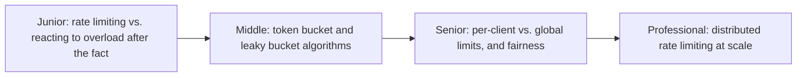
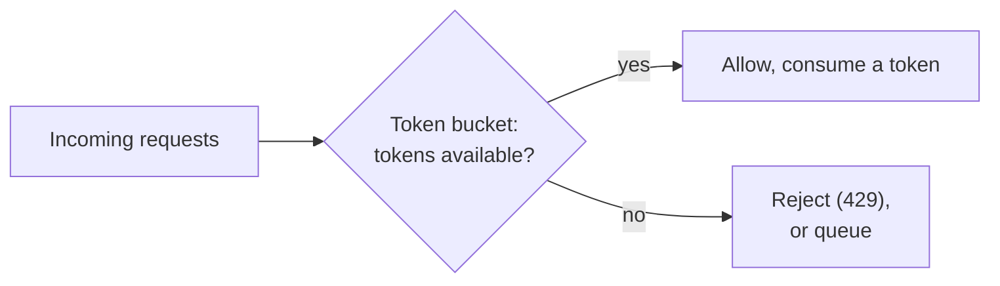

# Throttling

> Deliberately limit how much traffic a client (or the system as a whole)
> can send, before an overload happens — the proactive counterpart to
> circuit breakers, which react after things have already started failing.

## Choose a level

| Level | Guide | You are done when |
|---|---|---|
| Junior | [Proactive limiting vs. reactive failure](junior.md) | You can explain why throttling is applied before overload, not after. |
| Middle | [Token bucket and leaky bucket](middle.md) | You can trace both algorithms and explain when each fits better. |
| Senior | [Per-client limits and fairness](senior.md) | You can design a rate-limiting scheme that prevents one client from starving others. |
| Professional | [Distributed rate limiting](professional.md) | You can design a rate limiter that's consistent across many stateless service instances. |

## Practice rule

For any public or shared API, ask: "if one client sent 1,000x their normal
traffic right now, what would happen to every other client?" If the answer
is "they'd all be affected," you need throttling, not just capacity.

## Related

- [Circuit Breaker](../01-circuit-breaker/README.md)
- [Queue-Based Load Leveling](../09-queue-based-load-leveling/README.md)
