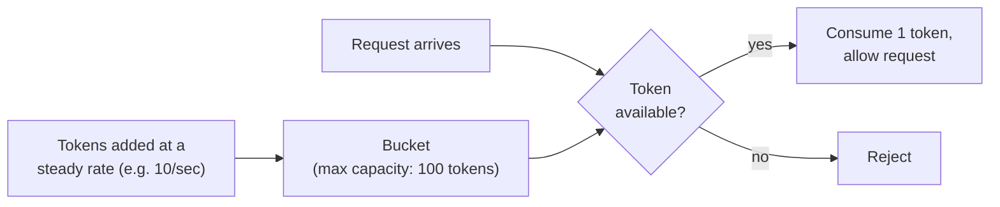
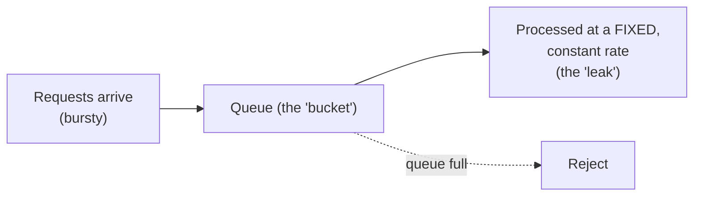

# Throttling — Middle

<!-- level-focus -->
At middle level, focus on this question:

> How do the token bucket and leaky bucket algorithms actually enforce a
> rate limit, and when does each fit better?

Prerequisite: [`junior.md`](junior.md).

---

## Token bucket: allows bursts, refills steadily



```python
class TokenBucket:
    def __init__(self, capacity, refill_rate):
        self.capacity = capacity
        self.tokens = capacity
        self.refill_rate = refill_rate
        self.last_refill = time.time()

    def allow(self):
        now = time.time()
        elapsed = now - self.last_refill
        self.tokens = min(self.capacity, self.tokens + elapsed * self.refill_rate)
        self.last_refill = now
        if self.tokens >= 1:
            self.tokens -= 1
            return True
        return False
```

A token bucket **allows bursts**: if the bucket has been idle and full, a
sudden spike of requests can consume all available tokens at once, as long
as the total doesn't exceed the bucket's capacity — appropriate for
traffic that's naturally bursty but averages out over time.

## Leaky bucket: smooths output to a constant rate



A leaky bucket queues incoming requests and processes them at a **strictly
constant** output rate, regardless of how bursty the input was — smoothing
traffic rather than allowing bursts through. This fits better when the
downstream system genuinely cannot handle bursts at all, even briefly, and
a steady, predictable processing rate matters more than accepting
short-term spikes.

| | Token bucket | Leaky bucket |
|---|---|---|
| Bursts | Allowed, up to bucket capacity | Smoothed out entirely |
| Output rate | Variable (up to capacity in a burst) | Strictly constant |
| Fits | APIs where occasional bursts are fine if average rate is respected | Systems where a constant processing rate is a hard requirement (e.g. protecting a fixed-capacity downstream resource) |

> 🎓 **Takeaway:** both algorithms enforce "not more than X per unit time"
> on average, but they differ in whether short-term bursts are tolerated
> (token bucket) or smoothed away entirely (leaky bucket) — choose based on
> whether your downstream system can tolerate bursts or needs a
> genuinely constant rate.

## Test yourself

1. Why can a token bucket allow a burst of 100 requests in a single
   instant, even with a refill rate of only 10/second?
2. Why does a leaky bucket never allow that same burst through, even if
   the bucket has been idle?
3. Which algorithm would you choose for rate-limiting calls to a
   downstream service with a hard, fixed maximum throughput it can never
   exceed even momentarily?

Continue to [`senior.md`](senior.md).
