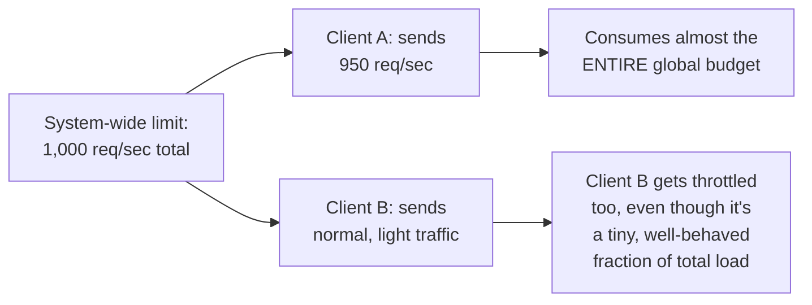
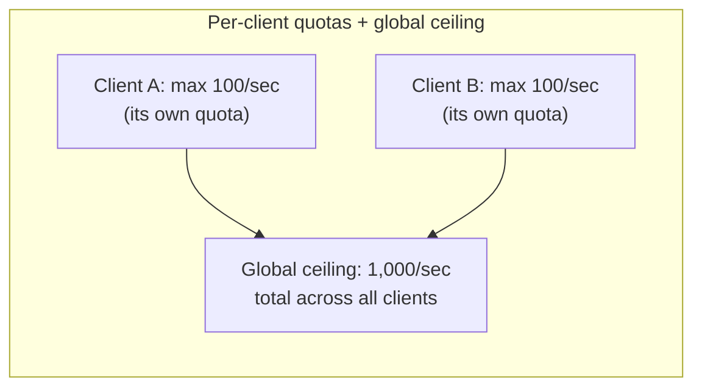

# Throttling — Senior

<!-- level-focus -->
At senior level, focus on this question:

> How do you prevent one heavy client from starving every other client
> under a shared, system-wide rate limit?

Prerequisite: [`middle.md`](middle.md).

---

## The starvation problem with a single global limit



A single, undifferentiated global rate limit protects the **system**, but
does nothing to ensure **fairness** among the clients sharing it — one
aggressive or misbehaving client can consume nearly the entire budget,
starving every other well-behaved client sharing the same limit.

## Per-client limits, with a shared ceiling



Enforcing a **per-client** (or per-API-key, per-tenant) quota, in addition
to (or instead of) a single global limit, guarantees each client a fair
share regardless of what other clients are doing — a misbehaving client
hits **its own** ceiling and gets throttled without affecting anyone else's
independent quota.

## Tiered limits based on business priority

```python
RATE_LIMITS = {
    "enterprise_tier": 1000,   # req/min
    "standard_tier": 100,
    "free_tier": 10,
}

def get_limit_for_client(client):
    return RATE_LIMITS.get(client.tier, RATE_LIMITS["free_tier"])
```

Beyond pure fairness (equal quotas for everyone), many production systems
intentionally give **different** quotas per client tier — a paying
enterprise customer's traffic is prioritized over a free-tier user's,
reflecting a business decision about whose traffic matters more under
contention, not a purely technical fairness calculation.

> 🎯 **Senior takeaway:** "throttling" without specifying **at what
> granularity** (global, per-client, per-tenant, per-tier) is an
> incomplete design — the granularity choice directly determines whether
> your rate limiting protects the system fairly, unfairly-but-
> intentionally by business priority, or not at all against a single
> misbehaving client.

## Test yourself

1. Why does a single global rate limit fail to protect well-behaved
   clients from a single aggressive one?
2. Why might a business deliberately choose unequal per-tier rate limits,
   rather than treating "fairness" as always meaning "equal for everyone"?
3. Design a rate-limiting scheme with both a per-client quota and a global
   system-wide ceiling — what happens if the sum of all clients' individual
   quotas exceeds the global ceiling?

Continue to [`professional.md`](professional.md) to design distributed
rate limiting across many stateless service instances.
