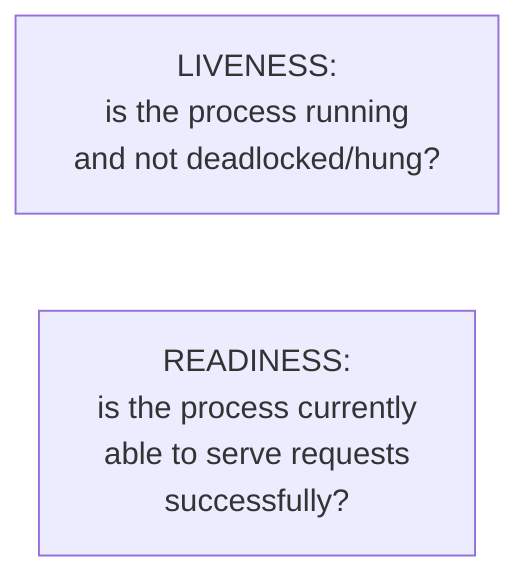
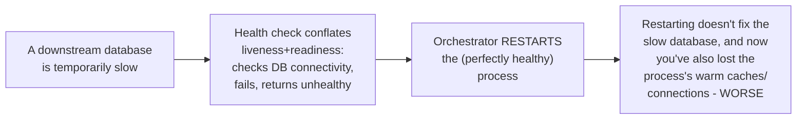

# Health Endpoint Monitoring — Junior

<!-- level-focus -->
At junior level, focus on this question:

> What's the difference between "is this process alive" and "is this
> process ready to serve traffic," and why does conflating them cause
> incidents?

---

## Two different questions

| Check | Answers | Action if it fails |
|---|---|---|
| **Liveness** | "Is this process fundamentally broken (hung, deadlocked, crashed internally) and needs to be restarted?" | Restart the process/container |
| **Readiness** | "Is this process currently able to handle requests successfully right now?" | Stop routing traffic to it, but don't restart — it might recover on its own (e.g. a temporarily overloaded downstream dependency) |

## Why conflating them causes incidents

If a single health check is used for **both** liveness and readiness, a
temporary downstream issue (which should only affect readiness — "don't
send me traffic right now") can trigger an unnecessary **restart**
(liveness's action), which does nothing to fix the actual problem and adds
the cost of cold-starting a process that wasn't actually broken.

> 🎓 **Takeaway:** liveness answers "should this specific process be
> restarted?" — readiness answers "should traffic be routed here right
> now?" These are different questions with different correct actions, and
> a single conflated health check routinely gets the response wrong for
> one of them.

## Test yourself

1. Why is "restart the process" the wrong response to a temporarily
   overloaded downstream dependency?
2. Give an example of a condition that should fail readiness but NOT
   liveness.
3. Give an example of a condition that should fail liveness (the process
   genuinely needs restarting).

Continue to [`middle.md`](middle.md).
