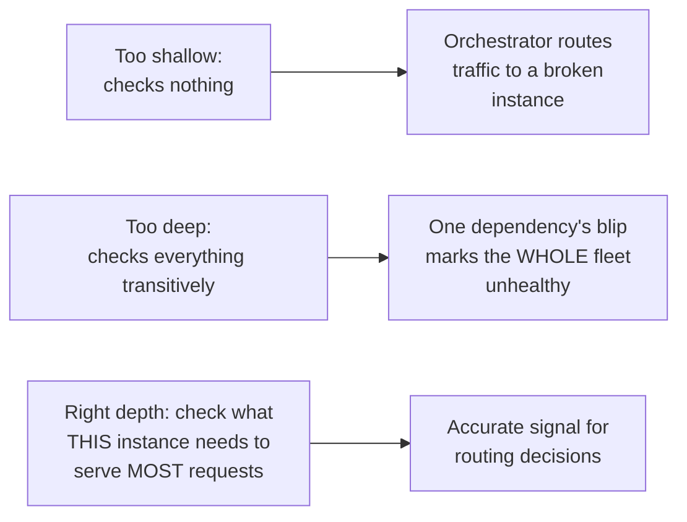

# Health Endpoint Monitoring — Middle

<!-- level-focus -->
At middle level, focus on this question:

> What should a health check actually verify — and what's the failure mode
> of checking too little versus too much?

Prerequisite: [`junior.md`](junior.md).

---

## Too shallow: always returns healthy

```python
@app.get("/health")
def health():
    return {"status": "ok"}  # ALWAYS returns ok, checks nothing real
```

This tells the orchestrator nothing — even a process that can't actually
serve any real requests (e.g. its database connection pool is completely
exhausted) still reports healthy, because the check never verifies
anything beyond "the HTTP server itself is responding."

## Too deep: checks everything, including things outside your control

```python
@app.get("/health")
def health():
    check_own_database()       # reasonable
    check_third_party_api()    # a THIRD PARTY's uptime, not yours
    check_every_downstream()   # any ONE of these failing marks YOU unhealthy
    return {"status": "ok"}
```

This is `senior.md`'s setup: if the health check verifies every
transitive dependency, a problem in **any one** of them marks your service
unhealthy — even if your service could still correctly serve the 90% of
requests that don't touch that particular dependency.

## A better middle ground: check what you actually need for readiness

```python
@app.get("/health/live")
def liveness():
    return {"status": "ok"}  # process is running, event loop is responsive

@app.get("/health/ready")
def readiness():
    if not db_pool.has_available_connections():
        return Response(status=503)  # can't serve most requests right now
    return {"status": "ok"}
```



> 🎓 **Takeaway:** a health check should verify the specific things that
> determine whether **this instance** can currently do its job — typically
> its own direct, hard dependencies (its own database connection, critical
> local resources) — not every transitive dependency down the entire call
> graph, and not nothing at all.

## Test yourself

1. Why does an always-`200` health check provide zero useful signal to an
   orchestrator?
2. Why is checking a non-critical third-party dependency in your readiness
   check dangerous, even if that dependency really is currently down?
3. Design the readiness check for a service that can still serve 80% of
   its endpoints without a specific optional caching layer, but needs its
   primary database for the rest.

Continue to [`senior.md`](senior.md).
