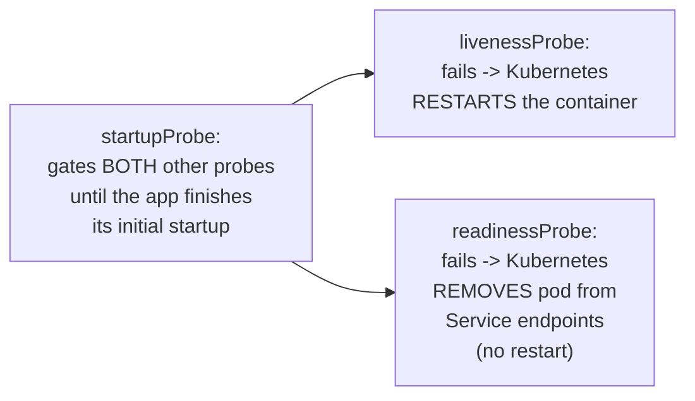
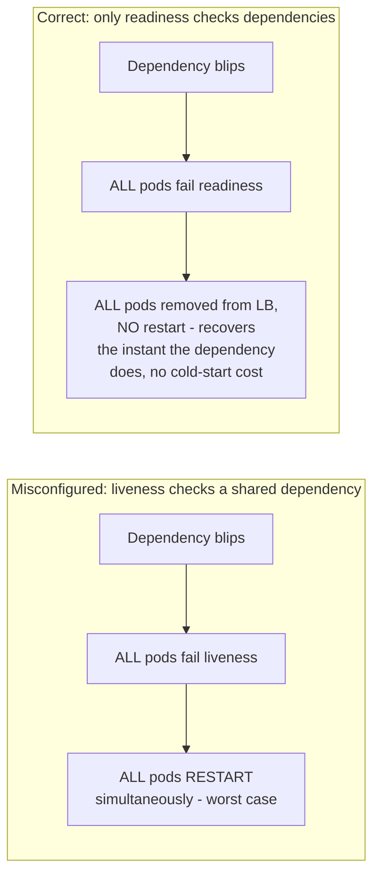

# Health Endpoint Monitoring — Professional

<!-- level-focus -->
At professional level, focus on this question:

> How do Kubernetes's three distinct probe types (liveness, readiness,
> startup) map onto the concepts from this topic, and what production
> incidents result from misconfiguring them?

Prerequisite: [`senior.md`](senior.md).

---

## Kubernetes's three probes, precisely



This maps directly onto `junior.md`'s distinction: `livenessProbe` failure
triggers a **restart** (the liveness action); `readinessProbe` failure
triggers **removal from load balancing** without a restart (the readiness
action). The **startup probe** is a third, distinct concept: it exists
specifically because a slow-starting application (loading a large cache, running
migrations) shouldn't have its liveness probe start counting failures
before it's even finished starting up — without a startup probe, a slow
initialization can be mistaken for a hung process and get killed and
restarted in a loop, **never actually finishing startup** (a well-documented
"CrashLoopBackOff from a slow-starting app" incident pattern).

## The documented incident: liveness probe checking a shared dependency

`senior.md`'s cascading-failure scenario has a specific, well-documented
Kubernetes incarnation: teams that configure `livenessProbe` (not just
`readinessProbe`) to check a shared downstream dependency create the worst
possible version of the cascade — a shared dependency blip doesn't just
remove pods from load balancing (recoverable, no data/state loss), it
**restarts every pod simultaneously**, which for a stateful or
slow-starting application can turn a brief downstream blip into an
extended, fleet-wide outage while every pod re-initializes at once. This
is a specific, avoidable misconfiguration:
**`livenessProbe` should almost never check external dependencies at
all** — reserve it strictly for "is this specific process's own internal
state healthy" (an internal deadlock/hang detector, an internal event-loop
responsiveness check), and put dependency checks only in `readinessProbe`.



## Production checklist (staff-level)

1. **Never put external dependency checks in `livenessProbe`** — reserve
   liveness exclusively for internal process-health signals (deadlock
   detection, event-loop responsiveness); put all dependency checks in
   `readinessProbe` only.
2. **Always configure a `startupProbe` for any service with meaningfully
   slow initialization**, with a generous enough `failureThreshold` ×
   `periodSeconds` window to cover worst-case startup time — this prevents
   the "restarted before it finished starting" loop.
3. **Design `readinessProbe` per `middle.md`'s guidance** (check what this
   instance needs for most requests, not every transitive dependency) to
   avoid the cascading total-outage failure mode from `senior.md`, now
   applied specifically to pod-removal-from-service rather than restarts.
4. **Set `readinessProbe` failure thresholds and periods to tolerate brief,
   genuinely transient blips** without immediately pulling a pod from
   rotation — a single failed probe shouldn't remove a pod; a sustained
   pattern should.
5. **In a Kubernetes deployment review, audit every service's probe
   configuration explicitly for dependency checks placed in the wrong
   probe type** — this is a specific, checkable, common misconfiguration
   with severe blast radius, worth a dedicated review checklist item.

## Cheat Sheet

```text
+------------------------------------------------------------------+
|         HEALTH ENDPOINT MONITORING — INTERNALS & SCALE                |
+------------------------------------------------------------------+
| Kubernetes probes:                                                    |
|   startupProbe  -> gates liveness/readiness until init completes;      |
|                     prevents killing a slow-starting app mid-boot       |
|   livenessProbe -> fail = RESTART the container                        |
|   readinessProbe -> fail = REMOVE from Service endpoints, NO restart   |
+------------------------------------------------------------------+
| CRITICAL rule: NEVER put external dependency checks in                 |
| livenessProbe - a shared dependency blip would RESTART the ENTIRE      |
| fleet simultaneously (worst case). Dependency checks belong ONLY in    |
| readinessProbe (removes from LB, no restart, recovers instantly        |
| when the dependency does, no cold-start cost)                          |
+------------------------------------------------------------------+
| Without a startupProbe, a slow-starting app can be killed by           |
| liveness before finishing init -> CrashLoopBackOff, never actually     |
| starts successfully                                                    |
+------------------------------------------------------------------+
```

## Test yourself

1. Why is putting a shared dependency check in `livenessProbe` strictly
   worse than putting it in `readinessProbe`, in terms of blast radius and
   recovery cost?
2. Why does a missing `startupProbe` cause a slow-starting application to
   potentially never successfully start at all, rather than just starting
   slowly?
3. Audit this probe configuration and identify the bug:
   `livenessProbe: checks database connectivity`,
   `readinessProbe: always returns 200`. What would you fix?

## Further Reading

- Kubernetes documentation — "Configure Liveness, Readiness and Startup
  Probes" (the official semantics referenced throughout this page).
- Kubernetes Failure Stories (k8s.af) — real, documented incidents from
  misconfigured probes, including the shared-dependency-in-liveness
  pattern.
- See also: [Circuit Breaker — professional](../01-circuit-breaker/professional.md),
  [Redundancy & Failure Domains](../10-redundancy-and-failure-domains/README.md).
