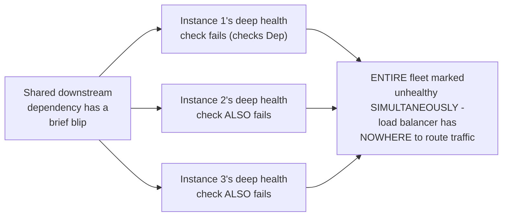
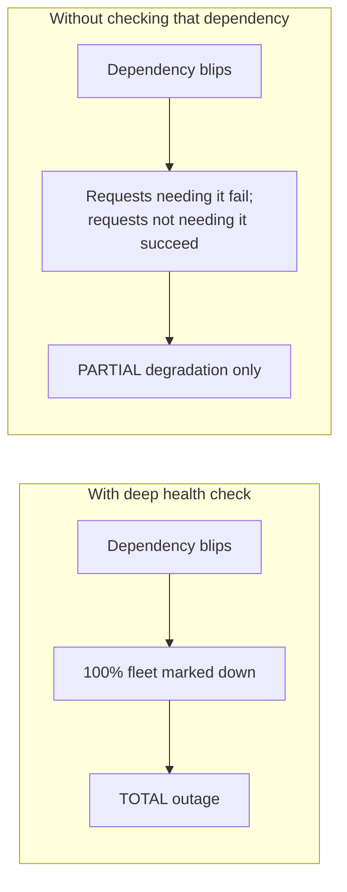

# Health Endpoint Monitoring — Senior

<!-- level-focus -->
At senior level, focus on this question:

> How can an overly deep health check cause an entire, otherwise-healthy
> fleet to be marked down simultaneously?

Prerequisite: [`middle.md`](middle.md).

---

## The cascading health-check failure

If every instance's health check verifies the same shared downstream
dependency (`middle.md`'s "too deep" example), a single blip in that one
dependency simultaneously fails **every** instance's health check at
once — the load balancer, seeing 100% of instances report unhealthy, has
**no healthy instance to route to**, turning a partial, recoverable
degradation (that dependency being briefly slow) into a **total outage**
of the entire service, even though every instance's own core logic is
perfectly fine.

## This is worse than the dependency's own outage would have been

Ironically, if the health check hadn't checked that dependency at all, the
service could have continued serving every request that **doesn't** need
it, degrading gracefully instead of going fully down — the deep health
check actively **converted a partial degradation into a total outage**,
which is the opposite of what health checking is supposed to achieve.

## The fix: health checks per-instance, degradation per-request

> 🎯 **Senior takeaway:** health checks should answer "should traffic be
> routed to **this instance at all**," not "is everything this instance
> could theoretically need currently perfect." Handle a specific
> dependency's unavailability at the **request** level (return a partial
> or degraded response, or a specific error for just the affected
> endpoints) rather than at the **instance** level (marking the whole
> instance unhealthy) — this keeps a shared dependency's blip from
> cascading into removing 100% of your serving capacity at once.

## Test yourself

1. Walk through exactly why a health check verifying a shared dependency
   can cause 100% of instances to fail simultaneously, rather than a
   random subset.
2. Why is "the entire fleet is marked unhealthy" strictly worse than "the
   dependency itself was briefly unavailable," from the end user's
   perspective?
3. Redesign the deep health check from `middle.md`'s bad example so that a
   third-party API blip degrades only the specific endpoints needing it,
   without failing the instance's overall health check.

Continue to [`professional.md`](professional.md) to configure Kubernetes
probes correctly at production scale.
