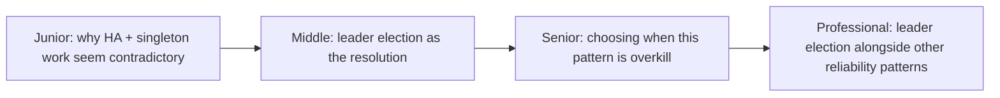
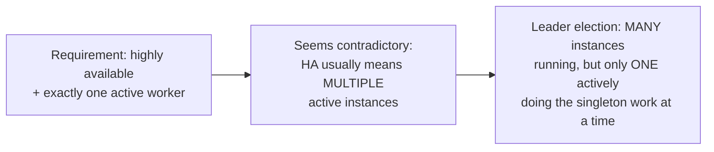

# Leader Election (as a Reliability Pattern)

> This is the same leader election covered in full technical depth at
> [Consensus: Leader Election](../../coordination/leader-election/README.md).
> This page exists specifically to frame it as a **reliability pattern** —
> the "how do I keep a singleton job highly available" lens — rather than
> repeat the consensus mechanics.

## Choose a level

| Level | Guide | You are done when |
|---|---|---|
| Junior | [The apparent contradiction](junior.md) | You can explain why "highly available" and "exactly one active worker" seem to conflict, and how leader election resolves it. |
| Middle | [Leader election as the resolution](middle.md) | You can map the reliability requirement onto the mechanics in the consensus topic. |
| Senior | [When this pattern is overkill](senior.md) | You can identify simpler alternatives for lower-stakes singleton work. |
| Professional | [Composing with other reliability patterns](professional.md) | You can design a system combining leader election, health checks, and circuit breakers coherently. |

## Practice rule

Before reaching for leader election, confirm you actually need **exactly
one** active instance, not just **at-least-one** — many "singleton" jobs
are actually fine running redundantly if made idempotent (see
[Retries & Idempotency](../../../schedule-jobs/04-retries-and-idempotency/README.md)),
which avoids needing leader election's complexity entirely.

## Related

- [Consensus: Leader Election](../../coordination/leader-election/README.md) — the full technical treatment
- [Health Endpoint Monitoring](../05-health-endpoint-monitoring/README.md)
- [Redundancy & Failure Domains](../10-redundancy-and-failure-domains/README.md)
