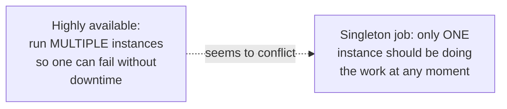
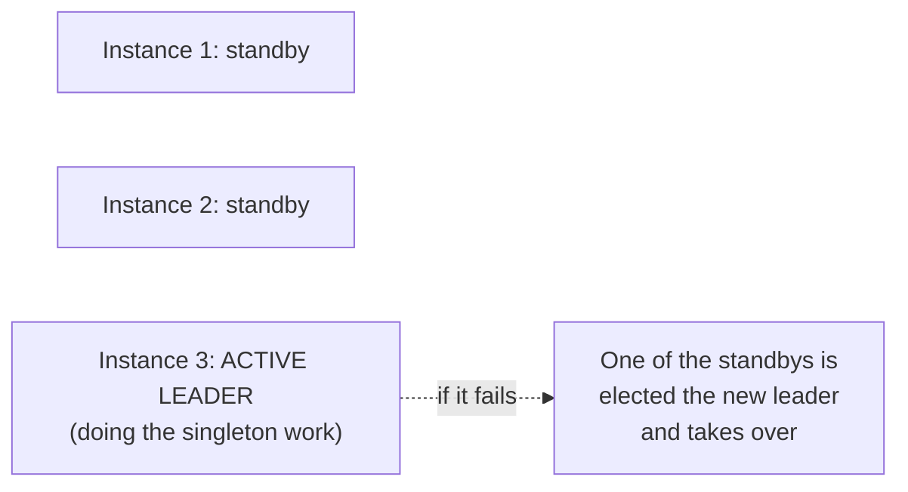

# Leader Election (Reliability Pattern) — Junior

<!-- level-focus -->
At junior level, focus on this question:

> Why do "highly available" and "exactly one active worker" seem to
> contradict each other, and how does leader election resolve it?

---

## The apparent contradiction

High availability usually means running multiple redundant instances so
any one can fail without taking the system down. But some jobs (a
scheduler tick, a compaction job, an ID sequencer — see
[Consensus: Leader Election](../../consensus/leader-election/README.md)'s
junior page) must have **exactly one** active worker at a time, or
duplicated execution causes real harm (double-counting, corrupted state,
duplicate side effects).

## The resolution: many instances, one active leader

Leader election lets you run **N redundant instances** (satisfying the
high-availability requirement — any one can fail) while guaranteeing only
**one** of them is ever actively doing the singleton work at a time
(satisfying the "exactly one" requirement) — the contradiction dissolves
once you realize "highly available" doesn't require "multiple instances
doing the same work simultaneously," just "multiple instances able to take
over the work."

> 🎓 **Takeaway:** leader election isn't a competing goal to high
> availability — it's specifically the mechanism that lets you achieve high
> availability **for a job that must not run more than once at a time**,
> which a naive "just run N copies" approach cannot safely do.

## Test yourself

1. Why can't you just run 3 copies of a scheduler job and let them all run
   independently, the way you would for a stateless web server?
2. In the resolution diagram, what happens to overall availability if
   Instance 3 (the leader) crashes?
3. Give one example of a job where running it twice simultaneously would
   be genuinely harmful, beyond the scheduler example.

Continue to [`middle.md`](middle.md).
