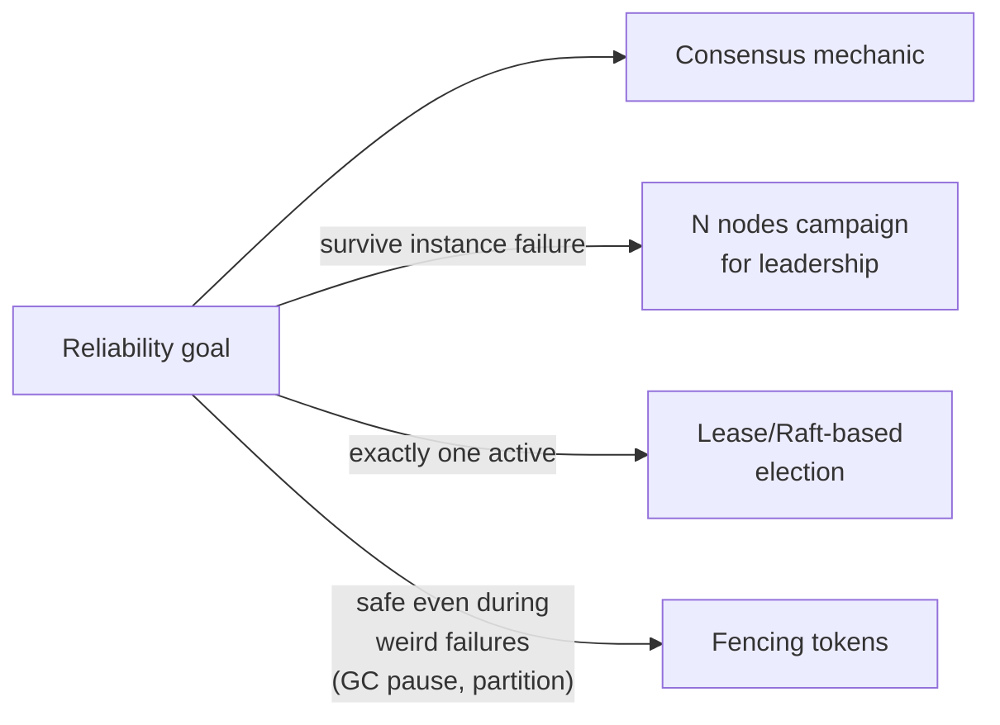

# Leader Election (Reliability Pattern) — Middle

<!-- level-focus -->
At middle level, focus on this question:

> How does the reliability requirement ("HA + singleton") map onto the
> actual mechanics covered in the consensus topic?

Prerequisite: [`junior.md`](junior.md).

---

## The mapping

| Reliability requirement | Mechanic from [Consensus: Leader Election](../../consensus/leader-election/README.md) |
|---|---|
| "Multiple instances for availability" | N nodes, all campaigning for leadership |
| "Exactly one active at a time" | Lease-based or Raft-based election ensures one winner |
| "Automatic failover if the active one dies" | Lease expiry + re-election (see that topic's `junior.md`/`middle.md`) |
| "No two instances doing the work simultaneously, even during a weird failure" | Fencing tokens (see that topic's `senior.md`) |



## A minimal example, from the reliability angle

```python
# 3 identical worker instances run this same code
election = etcd_client.election("/jobs/nightly-report-leader")
election.campaign(instance_id)  # blocks until this instance wins,
                                  # or another instance holds leadership

run_singleton_job()  # only the elected leader ever reaches this line
```

From a **reliability** point of view, what matters is: all 3 instances are
identical, interchangeable, and disposable — you can kill any one (even
the current leader) and the system self-heals by electing a new leader
from the remaining instances, with no manual intervention and no change to
which instances exist. This "just run N identical copies, let election
sort out who's active" pattern is what makes the singleton job as
resilient to instance failure as a stateless, horizontally-scaled service
would be.

> 🎓 **Takeaway:** from the reliability-pattern lens, leader election's
> value is that it turns a singleton job into something you can deploy,
> scale (for redundancy, not throughput), and restart exactly like any
> other stateless-looking service — the election mechanism absorbs all the
> complexity of "but only one of these copies should actually be doing
> the work."

## Test yourself

1. Why can all 3 worker instances run the exact same code, with no
   special configuration distinguishing "the leader" from "a standby" at
   deploy time?
2. What happens, from a deployment/ops perspective, if you kill the
   current leader instance in this setup? Compare it to killing a
   non-leader instance.
3. Why does adding redundancy here (running 3 instances instead of 1) not
   increase throughput the way it would for a stateless web service?

Continue to [`senior.md`](senior.md).
