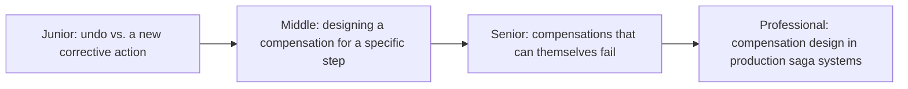
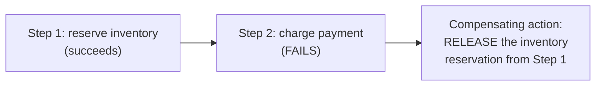

# Compensating Transaction

> When a multi-step operation fails partway through, you can't roll back
> steps that already committed in independent systems — you can only take a
> new action that semantically undoes the effect. This is the single-step
> building block that sagas are built from.

## Choose a level

| Level | Guide | You are done when |
|---|---|---|
| Junior | [Undo vs. a new corrective action](junior.md) | You can explain why you can't literally "roll back" a step in a different system. |
| Middle | [Designing a compensation](middle.md) | You can design a compensating action for a specific committed step. |
| Senior | [Compensations that fail](senior.md) | You can design a retry/escalation strategy for a compensation that itself fails. |
| Professional | [Compensation design in production sagas](professional.md) | You can design a full compensation strategy for a multi-step saga with a non-compensatable pivot step. |

## Practice rule

For every step in a multi-step business process, ask: "if this step
succeeds but a later step fails, what specific action would semantically
undo this step's effect?" If you can't name one, that step might be a
pivot point (see [Saga: Orchestration vs Choreography](../../distributed-transaction/07-saga-orchestration-vs-choreography/README.md))
requiring special handling.

## Related

- [Saga: Orchestration vs Choreography](../../distributed-transaction/07-saga-orchestration-vs-choreography/README.md)
- [Atomic Commit: 2PC, 3PC, TCC](../../coordination/07-atomic-commit-2pc-3pc-tcc/README.md)
