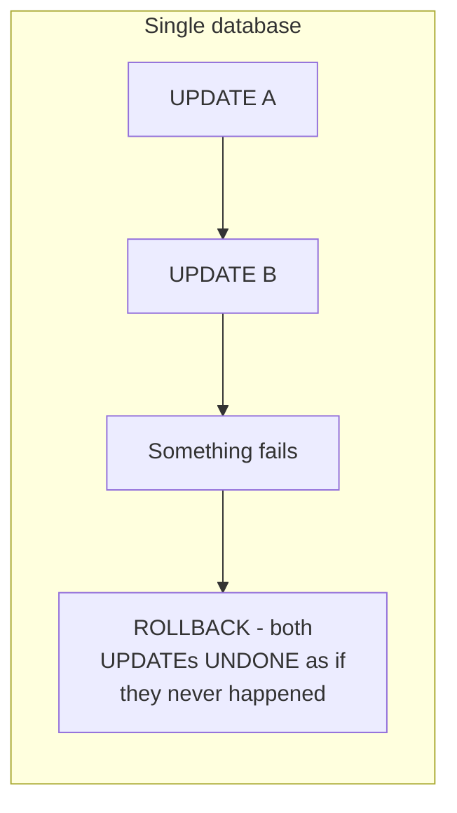
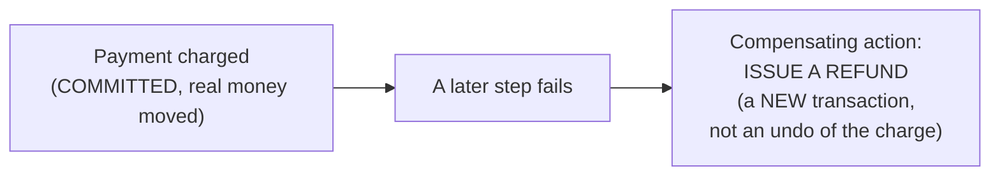

# Compensating Transaction — Junior

<!-- level-focus -->
At junior level, focus on this question:

> Why can't you "roll back" a step that already committed in a different
> system, the way a database rolls back an uncommitted transaction?

---

## Rollback only works within one transaction manager

A database `ROLLBACK` works because the changes were never actually
**committed** — they existed only in an uncommitted transaction the engine
can discard entirely. Once a step has genuinely **committed** in an
independent system (a payment was charged, an email was sent, inventory
was decremented and the change is now visible to other systems), there's
no "undo" mechanism — that fact is now true in the world.

## A compensating transaction: a new action, not an undo

A **refund** doesn't erase the fact that a charge happened — it's a
**new**, separate transaction that has the **net effect** of returning the
money. The customer's bank statement will show both the charge and the
refund; the charge genuinely happened and cannot be made to have "never
happened."

> 🎓 **Takeaway:** a compensating transaction achieves the same **business
> outcome** as an undo (money back where it started, inventory back to its
> prior count) but does so via a new, forward-moving action, not a true
> reversal — this distinction matters because compensations have their own
> failure modes, side effects, and visibility that a true rollback never
> would.

## Test yourself

1. Why can a database's `ROLLBACK` erase a transaction entirely, while a
   refund can never make a charge "never have happened"?
2. Why might a customer be confused seeing both a charge and a refund on
   their statement, and what does that tell you about compensations not
   being invisible undos?
3. Design a compensating action for "an email confirmation was already
   sent" if a later step in the same process fails — what would this
   compensation actually do?

Continue to [`middle.md`](middle.md).
