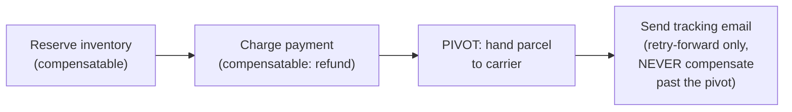
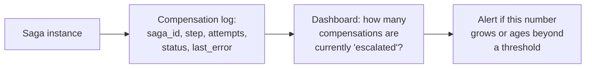

# Compensating Transaction — Professional

<!-- level-focus -->
At professional level, focus on this question:

> How do production saga systems formally handle a "pivot" step — one that
> genuinely cannot be compensated once it happens — and what's the
> compensation-log architecture that makes this auditable at scale?

Prerequisite: [`senior.md`](senior.md).

---

## The pivot transaction: the point of no return

Every real saga has (at most) one **pivot step** — the point past which
the process can only go forward, never backward. Once a parcel is
physically handed to a carrier, "un-shipping" it isn't a software problem
you can solve with a compensating action; it's a real-world logistics
event that already happened. Production saga design (as documented in the
Saga: Orchestration vs Choreography topic) requires explicitly identifying
this pivot and designing every step **before** it to be cleanly
compensatable, while every step **after** it can only retry-forward to
eventual success (never compensate) — this asymmetry must be a deliberate
design decision made during saga design, not discovered during an
incident.



## Compensation-log architecture: making failed compensations auditable

At production scale, a saga's compensation attempts (per `senior.md`'s
retry/escalation strategy) need a durable, queryable **compensation log** —
not just application logs, but a structured record: which saga instance,
which step, how many compensation attempts, current status
(pending/retrying/escalated/resolved). This is the same structured-
failure-metadata discipline from the event-driven jobs professional page's
DLQ design, applied specifically to compensations — because a compensation
stuck in "escalated, awaiting human resolution" for an extended period is
a genuine financial/data-integrity risk that needs its own dashboard and
alerting, distinct from ordinary application error monitoring.



## Reconciliation as the ultimate safety net

Beyond automated compensation and human escalation, production financial/
inventory systems typically run a periodic **reconciliation job**: compare
the saga system's recorded state (via the compensation log and saga
instance table) against the actual source-of-truth systems (the payment
provider's transaction records, the warehouse's physical inventory count)
to catch any drift that slipped through both the automated compensation
and the human-escalation path — treating compensation as the primary
defense but reconciliation as the final, independent verification that
nothing was silently missed.

## Production checklist (staff-level)

1. **Identify and document the pivot step explicitly for every saga**, and
   design every step before it as cleanly compensatable, every step after
   it as retry-forward-only — this is a deliberate design artifact, not an
   implicit assumption.
2. **Build a structured, durable compensation log** as core saga
   infrastructure, not an afterthought — every compensation attempt,
   success, or escalation should be queryable and auditable.
3. **Dashboard and alert on "compensations currently escalated/awaiting
   human resolution"** as a first-class operational metric, with an aging
   threshold that pages if a compensation sits unresolved too long.
4. **Run periodic reconciliation against source-of-truth systems**
   (payment provider records, physical inventory) as an independent
   verification layer beneath the compensation system, catching anything
   that slipped through both automated retry and human escalation.
5. **In a saga design review, require an explicit answer for "what is the
   pivot step, and how do we know"** before approving the design — a saga
   without a clearly identified pivot is a saga where someone will
   eventually try to compensate an uncompensatable real-world action.

## Cheat Sheet

```text
+------------------------------------------------------------------+
|            COMPENSATING TRANSACTION — INTERNALS & SCALE               |
+------------------------------------------------------------------+
| PIVOT STEP: the point of no return in a saga - everything before it   |
| must be cleanly compensatable; everything after it can only RETRY-    |
| FORWARD to success, never compensate. Must be explicitly identified   |
| during design, not discovered during an incident                      |
+------------------------------------------------------------------+
| Compensation log: durable, structured record per compensation          |
| attempt (saga_id, step, attempts, status, last_error) - the same       |
| discipline as a production DLQ, applied to compensations specifically |
+------------------------------------------------------------------+
| Dashboard + alert on "escalated, awaiting human resolution" count      |
| and age - a stuck compensation is a real financial/data-integrity      |
| risk needing dedicated monitoring, not generic error tracking          |
+------------------------------------------------------------------+
| Reconciliation against source-of-truth systems = the FINAL,            |
| independent safety net beneath compensation + human escalation         |
+------------------------------------------------------------------+
```

## Test yourself

1. Why must the pivot step be identified explicitly during saga design,
   rather than left implicit and discovered later?
2. Why does a compensation log need the same structured-metadata rigor as
   a production dead-letter queue?
3. Design a reconciliation job that compares a saga system's recorded
   payment-refund state against a payment provider's actual transaction
   records, and decide what threshold of drift should page someone.

## Further Reading

- Chris Richardson — *Microservices Patterns*, Ch. 4 (the pivot
  transaction concept, formally named and explained).
- Caitie McCaffrey — "Applying the Saga Pattern" (production saga design
  including compensation failure handling).
- See also: [Saga: Orchestration vs Choreography](../../distributed-transaction/07-saga-orchestration-vs-choreography/README.md).
