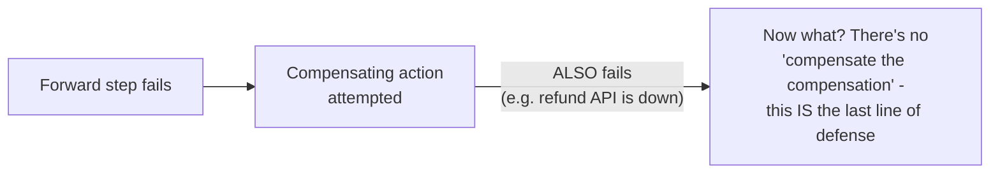
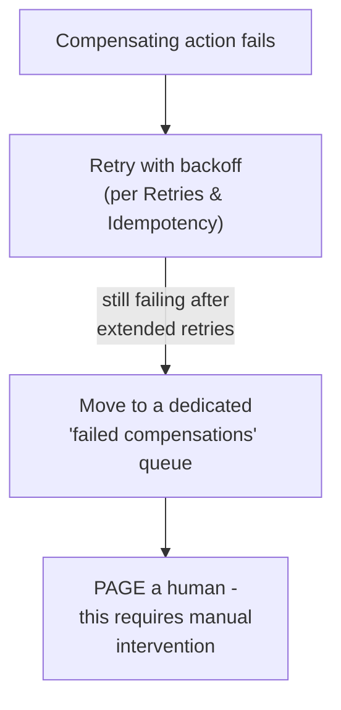

# Compensating Transaction — Senior

<!-- level-focus -->
At senior level, focus on this question:

> What do you do when a compensating action itself fails?

Prerequisite: [`middle.md`](middle.md).

---

## Compensations have no compensation of their own



If the compensating action itself fails (the refund API is down, the
inventory-release call times out), there's no further fallback layer —
you cannot compensate a compensation with another compensation
indefinitely. This means compensating actions need to be treated with
**extra** reliability rigor, not the same or less rigor than the forward
steps they're undoing.

## The strategy: retry relentlessly, then escalate to a human



Unlike a forward step (which can often just report failure and let the
overall operation fail cleanly), a **failed compensation** leaves the
system in a genuinely inconsistent state (money charged with no
corresponding refund, inventory reserved with no corresponding order) —
this is exactly the kind of situation that justifies escalating to a human
after automated retries are exhausted, rather than silently giving up.

## Designing for the "compensation itself might fail" case up front

```python
def compensate_with_guaranteed_delivery(compensation_fn, max_retries=10):
    for attempt in range(max_retries):
        try:
            compensation_fn()
            return
        except Exception as e:
            log.error(f"Compensation attempt {attempt} failed: {e}")
            time.sleep(backoff_with_jitter(attempt))
    # exhausted retries - this is now a human problem
    alert_oncall(f"Compensation failed after {max_retries} attempts")
    write_to_manual_intervention_queue(compensation_fn)
```

> 🎯 **Senior takeaway:** treat compensating actions as **more**
> critical than the forward steps they undo, not less — they are the last
> automated line of defense against a genuinely inconsistent system state,
> and their failure mode must be explicitly designed (aggressive retry,
> then guaranteed human escalation), not left as an afterthought "well,
> it'll probably work."

## Test yourself

1. Why can't you simply write another compensating action to handle a
   failed compensation, ad infinitum?
2. Why does a failed compensation justify paging a human, when a failed
   forward step often doesn't?
3. Design the retry and escalation policy for a refund compensation that
   calls a payment provider's API — how many retries, what backoff, and at
   what point does it become a human's problem?

Continue to [`professional.md`](professional.md) to design compensation
strategy for a full production saga with a non-compensatable step.
