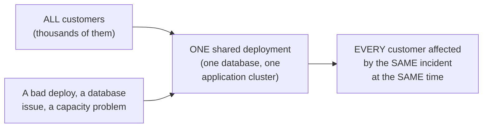
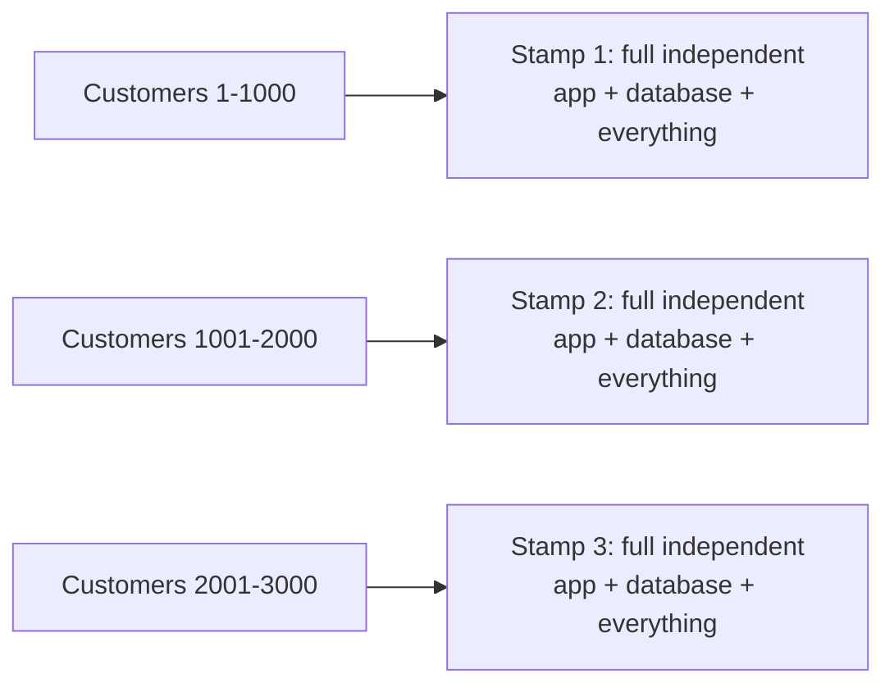

# Deployment Stamps & Geodes — Junior

<!-- level-focus -->
At junior level, focus on this question:

> Why does a single shared deployment mean every customer is affected by
> the same outage, and how do multiple independent "stamps" fix that?

---

## One shared deployment: one shared blast radius

If every customer's data and traffic flow through one shared deployment,
any incident affecting that deployment — a bad code deploy, a database
issue, a capacity overload — affects **every** customer simultaneously.
There's no isolation: the blast radius of any failure is the entire
customer base.

## Stamps: many identical, independent copies

A **deployment stamp** is a complete, independent, self-contained copy of
the entire application stack — its own application instances, its own
database, its own everything — serving a **subset** of customers. A bad
deploy or database incident affecting Stamp 1 only affects the customers
assigned to Stamp 1; Stamps 2 and 3 keep running, completely unaffected,
because they share **nothing** with Stamp 1.

> 🎓 **Takeaway:** stamping trades operational simplicity (one deployment
> to manage) for blast-radius containment (many smaller, isolated
> deployments) — the same fundamental principle as bulkheading and database
> federation, applied at the whole-system deployment level rather than a
> single resource pool or database.

## Test yourself

1. Why does a single shared deployment mean an incident's blast radius is
   always "everyone," regardless of how the incident started?
2. If you have 3 stamps and Stamp 2 goes down, what happens to customers
   on Stamp 1 and Stamp 3?
3. What's the operational cost of running 3 independent stamps compared to
   1 shared deployment — what do you now have 3x as much of?

Continue to [`middle.md`](middle.md).
