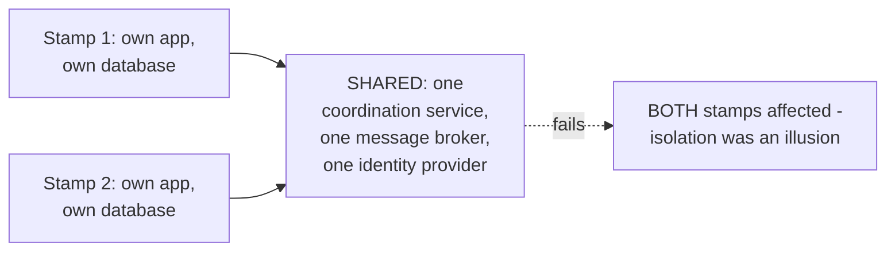
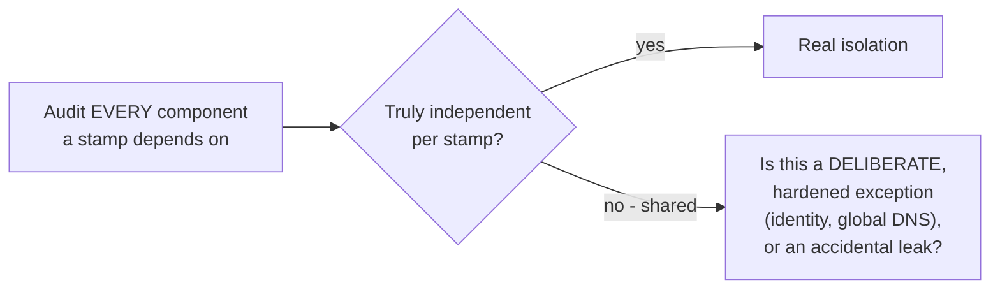

# Deployment Stamps & Geodes — Middle

<!-- level-focus -->
At middle level, focus on this question:

> What shared dependency, if overlooked, silently undermines stamp
> isolation?

Prerequisite: [`junior.md`](junior.md).

---

## The hidden shared dependency trap

A team can build stamps with independent application servers and
independent databases, but still accidentally share a **single**
authentication service, a **single** coordination cluster
(see [Coordination Services](../../18-concurrency-coordination/05-coordination-services/README.md)),
or a **single** message broker across all stamps — any of these becomes a
hidden, unstamped single point of failure that silently defeats the entire
purpose of stamping, because a failure there still takes down every stamp
simultaneously.

## What must be independent per stamp

| Component | Must be per-stamp for true isolation |
|---|---|
| Application servers | Yes — obviously |
| Database | Yes — a shared database means a database incident affects every stamp |
| Message broker / queue | Yes — a shared Kafka cluster is a shared failure domain |
| Coordination service (etcd/ZooKeeper) | Yes — per the Coordination Services professional page's blast-radius discussion |
| Authentication/identity provider | Often shared deliberately (a genuine cross-cutting concern), but then it must be engineered to an even higher availability bar than any individual stamp, since it's now everyone's single point of failure |
| DNS / global routing layer | Necessarily shared at some level — this is exactly what `professional.md`'s geode routing layer must be engineered carefully around |

> 🎓 **Takeaway:** stamping is only as good as its **weakest shared
> component** — a single accidentally-shared dependency (a coordination
> cluster, a message broker) reintroduces exactly the single point of
> failure stamping was meant to eliminate. Any deliberately shared
> component (identity, global routing) must be explicitly identified and
> engineered to a higher availability standard than any individual stamp.

## Test yourself

1. Why does a shared coordination service across all stamps completely
   undermine the isolation stamping is meant to provide?
2. Why might a team deliberately choose to share an authentication service
   across stamps rather than duplicating it per stamp — what's the
   trade-off?
3. Audit a hypothetical stamped architecture: app servers per-stamp,
   databases per-stamp, but ONE shared Redis cache for session data across
   all stamps. What's the isolation gap here?

Continue to [`senior.md`](senior.md).
