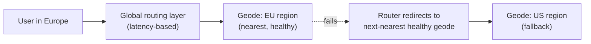
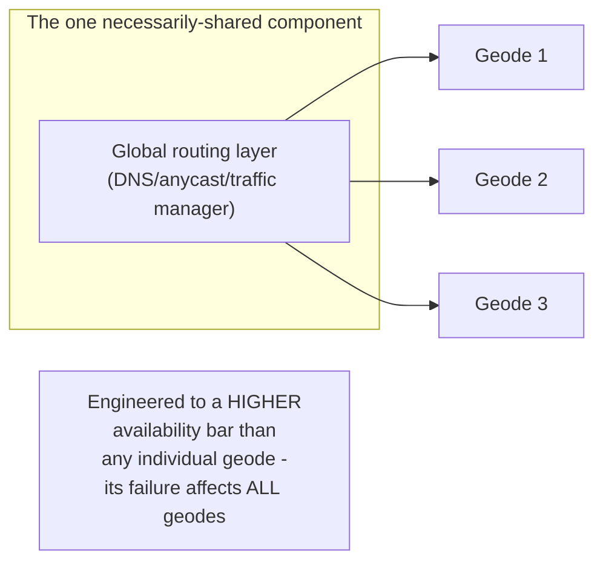

# Deployment Stamps & Geodes — Professional

<!-- level-focus -->
At professional level, focus on this question:

> What is a "geode," how does it extend stamping with active-active global
> routing, and what does the global routing layer itself need to be
> engineered against as a shared dependency?

Prerequisite: [`senior.md`](senior.md).

---

## Geodes: stamps plus active-active, latency-based global routing

A **geode** (Azure's naming for this pattern) is a deployment stamp that's
additionally **active-active** across regions for the **same** data —
rather than each stamp owning a disjoint subset of customers, a geode
architecture replicates data across multiple regional stamps and routes
each request to the **nearest healthy** geode, with all geodes able to
serve any customer's traffic. This differs from plain stamping (`junior.md`,
where each stamp owns a disjoint customer subset) specifically in
providing both **geographic latency optimization** and **regional failover**
for every customer, not just isolation between customer groups.



## The global routing layer: the one component that can't be fully stamped

`middle.md` identified the risk of a hidden shared dependency undermining
isolation. In a geode architecture, the **global routing layer itself**
(DNS-based, or a global anycast/traffic-manager service) is **necessarily**
a single, shared, cross-geode component by definition — its entire job is
routing traffic *among* geodes, so it cannot itself be geode-isolated. This
means the routing layer must be engineered to a categorically higher
availability standard than any individual geode (often using globally
distributed, highly redundant DNS/anycast infrastructure specifically
because this component's own failure would affect every geode's ability to
receive traffic at once) — the professional-level acknowledgment that
**some shared component is unavoidable**, and the design response is to
make that specific component exceptionally robust rather than pretending
it doesn't exist.



## Data replication across geodes: the consistency cost

Because geodes serve the **same** data (unlike stamps' disjoint customer
subsets), a geode architecture must replicate data across regions — which
means confronting the exact CAP-theorem trade-off from earlier in this
tree (see the CAP Theorem topic and BASE & Eventual Consistency), typically
resolved via multi-leader or leaderless replication with eventual
consistency and conflict resolution (LWW, vector clocks, or CRDTs), because
synchronous cross-region replication for every write would defeat the
latency benefit that's the whole point of routing users to their nearest
geode in the first place.

## Production checklist (staff-level)

1. **Decide deliberately between plain stamps (disjoint customer subsets,
   strong isolation) and geodes (shared data, active-active, lower
   latency + regional failover)** based on whether your actual requirement
   is isolation between customer groups or latency/failover for the same
   customer base globally — these solve different problems.
2. **Engineer the global routing layer to the highest achievable
   availability standard**, explicitly acknowledging it as the one
   necessarily-shared component in a geode architecture — invest
   disproportionately here relative to individual geode availability
   engineering.
3. **Choose a replication/consistency model for cross-geode data
   explicitly**, accepting the CAP-theorem trade-off rather than assuming
   synchronous consistency is achievable without sacrificing the latency
   benefit that motivated the geode architecture.
4. **Test regional failover explicitly** (kill an entire geode in a game
   day) to verify the routing layer correctly redirects traffic and the
   remaining geodes can absorb the failed geode's load without cascading
   overload.
5. **In an architecture review proposing a geode design, require an
   explicit data-consistency model and routing-layer availability
   engineering plan** before approving — these are the two places geode
   architectures most commonly have unaddressed gaps.

## Cheat Sheet

```text
+------------------------------------------------------------------+
|         DEPLOYMENT STAMPS & GEODES — INTERNALS & SCALE               |
+------------------------------------------------------------------+
| Stamps: disjoint customer subsets, each fully independent -            |
| STRONG isolation between customer groups, no shared data               |
| Geodes: SAME data replicated across regional stamps, ACTIVE-ACTIVE,    |
| latency-based routing to nearest healthy geode + regional failover     |
+------------------------------------------------------------------+
| The GLOBAL ROUTING LAYER is the one component that CANNOT be           |
| geode-isolated by definition (its job is routing AMONG geodes) -       |
| must be engineered to a HIGHER availability bar than any individual   |
| geode, since its failure affects every geode's ability to receive      |
| traffic                                                                |
+------------------------------------------------------------------+
| Geode data replication confronts the CAP trade-off directly -          |
| synchronous cross-region consistency defeats the latency benefit,      |
| so eventual consistency + conflict resolution (LWW/vector clocks/      |
| CRDTs) is the typical resolution                                      |
+------------------------------------------------------------------+
```

## Test yourself

1. Why can't the global routing layer in a geode architecture itself be
   geode-isolated, and what does this imply about how it must be
   engineered?
2. Why does a geode architecture confront the CAP theorem trade-off in a
   way that plain stamping (disjoint customer subsets) doesn't?
3. Design the failover test (game day) you'd run to validate a 3-geode
   architecture's resilience to losing one entire geode.

## Further Reading

- Microsoft Azure Architecture Center — "Deployment Stamps pattern" and
  "Geode pattern" (the specific naming and reference architecture this
  page builds on).
- See also: [CAP Theorem](../../02-tradeoffs-framework/01-cap-theorem/README.md),
  [Redundancy & Failure Domains](../10-redundancy-and-failure-domains/README.md).
