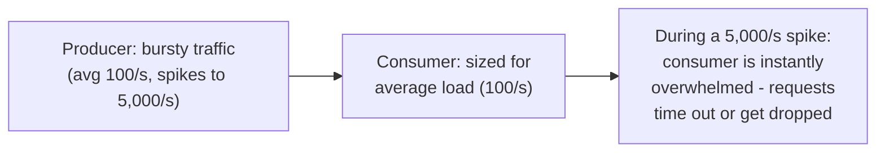
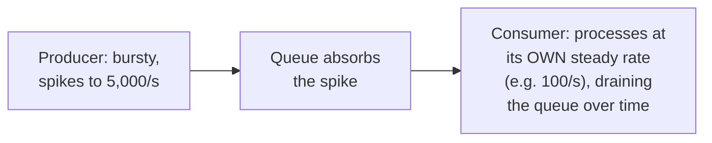

# Queue-Based Load Leveling — Junior

<!-- level-focus -->
At junior level, focus on this question:

> Why does a consumer sized for average load fall over during a burst,
> without a queue to absorb it?

---

## Direct connection: consumer must handle every spike in real time

If a producer calls a consumer **directly**, the consumer must be
provisioned to handle the **peak** traffic rate, not just the average —
because there's nothing between them to absorb the difference. Sizing for
the peak (rather than the average) means paying for capacity that sits
mostly idle, since most traffic never actually reaches peak levels.

## Inserting a queue: decoupling arrival rate from processing rate

A queue between them means the producer's burst is absorbed as a growing
(but temporary) **queue depth**, while the consumer continues processing at
whatever rate it's actually sized for — the burst gets processed **over
time**, not instantly, but nothing is dropped or overwhelmed. This is the
fundamental trade: **latency** for individual items during a burst (they
wait in the queue) in exchange for the consumer never needing peak-sized
capacity.

> 🎓 **Takeaway:** queue-based load leveling turns "the consumer must be
> sized for the worst-case burst" into "the consumer can be sized for
> sustainable average throughput, and the queue absorbs the difference
> temporarily" — a direct cost/latency trade-off that's usually a very
> good deal, since most systems' bursts are short relative to their
> average-load periods.

## Test yourself

1. Why is sizing a consumer for peak load often wasteful, in terms of idle
   capacity most of the time?
2. What does a queue actually do to a burst — does it eliminate the extra
   load, or just delay when it's processed?
3. What's the real cost users/callers pay when load leveling absorbs a
   burst — what happens to their request's latency during that burst?

Continue to [`middle.md`](middle.md).
