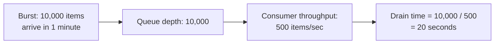

# Queue-Based Load Leveling — Middle

<!-- level-focus -->
At middle level, focus on this question:

> How do you size the queue and consumer pool together so a burst drains
> in an acceptable amount of time?

Prerequisite: [`junior.md`](junior.md).

---

## The drain-time calculation



```
drain_time = queue_depth / consumer_throughput
```

If a burst of 10,000 items arrives and your consumer pool processes 500
items/second, the queue drains in 20 seconds — meaning the **last** item in
that burst waits roughly 20 seconds before being processed. Whether that's
acceptable depends entirely on your latency requirements for the work
being queued: 20 seconds is fine for "process this uploaded video," and
completely unacceptable for "authorize this credit card payment."

## Sizing the consumer pool for your latency requirement

```python
# Given: expected burst size, acceptable max drain time
max_acceptable_drain_seconds = 5
expected_burst_size = 10000

required_throughput = expected_burst_size / max_acceptable_drain_seconds
# = 2000 items/sec needed

consumers_needed = required_throughput / per_consumer_throughput
```

Rather than sizing the consumer pool for "average load" alone
(`junior.md`'s baseline), a more precise design works backward from your
**acceptable drain time for your worst realistic burst** — this gives you
a consumer pool sized specifically to meet a latency SLA during bursts,
not just to handle steady-state traffic.

> 🎓 **Takeaway:** queue-based load leveling isn't "add a queue and stop
> worrying" — the queue's size and the consumer pool's throughput must be
> co-designed against your actual burst size expectations and your
> acceptable processing-delay tolerance, which differs enormously by use
> case.

## Test yourself

1. If your acceptable drain time is 5 seconds and your expected burst is
   50,000 items, how much consumer throughput do you need?
2. Why is "20 seconds of delay" acceptable for video processing but
   unacceptable for payment authorization — what property of the work
   determines this?
3. What would you do if the required consumer throughput to meet your
   latency SLA is higher than what a single consumer instance can provide?

Continue to [`senior.md`](senior.md).
