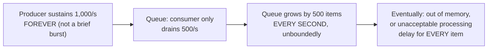
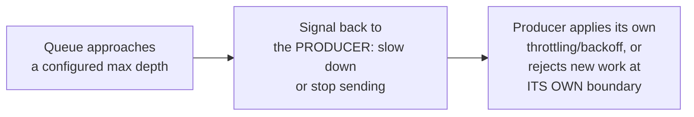

# Queue-Based Load Leveling — Senior

<!-- level-focus -->
At senior level, focus on this question:

> What happens if the producer's burst is sustained (not brief), and the
> queue has no size limit — and how does backpressure fix it?

Prerequisite: [`middle.md`](middle.md).

---

## Unbounded queue growth: a delayed version of the same overload

`middle.md`'s drain-time math assumes the burst is **temporary** — the
producer eventually slows back down to a rate the consumer can keep up
with. If the elevated rate is actually **sustained** (not a brief spike but
a genuine, ongoing rate increase exceeding consumer capacity), an unbounded
queue doesn't prevent overload — it just **delays** it, while making it
worse in the meantime (every item now waits behind an ever-growing backlog,
and the queue itself eventually exhausts memory/storage).

## Backpressure: pushing back on the producer, not just absorbing forever

**Backpressure** closes the gap: once the queue reaches a configured
maximum depth, the system signals the **producer** to slow down (via a
credit-based flow control mechanism, per the Event-Driven Background Jobs
professional page) or explicitly rejects new work at the producer's own
boundary (returning a `429 Too Many Requests` to an upstream caller,
rather than accepting it into an ever-growing queue). This converts
"unbounded, silent queue growth eventually leading to catastrophic
failure" into "an explicit, visible, immediate signal that the system is
at capacity" — a far more manageable failure mode.

> 🎯 **Senior takeaway:** a queue only "levels load" for **temporary**
> bursts — for a genuinely sustained rate mismatch between producer and
> consumer, an unbounded queue just delays and worsens the eventual
> failure. Bounding the queue and implementing backpressure back to the
> producer converts an eventual catastrophic failure into an immediate,
> explicit, and far more debuggable one.

## Test yourself

1. Why does an unbounded queue not actually prevent overload for a
   sustained (not temporary) rate mismatch — what does it do instead?
2. Why is "reject new work explicitly at the producer's boundary" a better
   failure mode than "accept everything into an ever-growing queue"?
3. Design a bounded-queue policy: what should happen to new items once the
   queue reaches its configured maximum depth?

Continue to [`professional.md`](professional.md) to design consumer
autoscaling driven by queue depth metrics.
