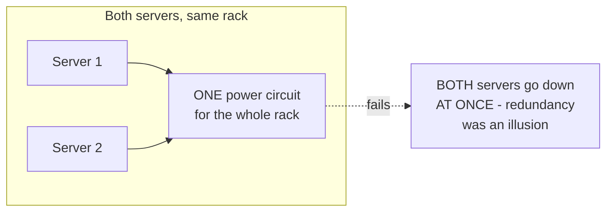
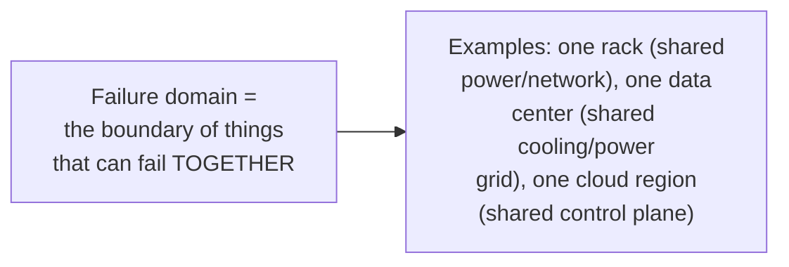

# Redundancy & Failure Domains — Junior

<!-- level-focus -->
At junior level, focus on this question:

> Why doesn't running two servers automatically give you real redundancy?

---

## Redundancy that shares a hidden single point of failure

Two servers sitting in the same physical rack share the rack's power
circuit, its network switch, and often its physical building. If any of
those fail, **both** servers go down together — the redundancy you thought
you had (2 servers instead of 1) provided zero actual protection against
the specific failure that took out the shared component.

## A failure domain is "everything that fails together"

Real redundancy requires placing copies in **different** failure
domains — different racks (different power circuits), different
availability zones (different physical facilities), or different regions
entirely, depending on what scale of failure you're protecting against.

> 🎓 **Takeaway:** the number of copies you have (2, 3, N) matters far less
> than whether those copies share a failure domain. Two copies in the same
> failure domain provide **no** more protection against that domain's
> failure than a single copy would.

## Test yourself

1. Why do two servers in the same rack provide no protection against a
   power circuit failure, even though there are "two" of them?
2. What's the smallest change you could make to the same-rack setup to
   give it real redundancy against a rack-level failure?
3. Name a failure that would affect two servers in the same city but
   different neighborhoods, if such a failure exists — what would that
   tell you about the boundary of that particular failure domain?

Continue to [`middle.md`](middle.md).
