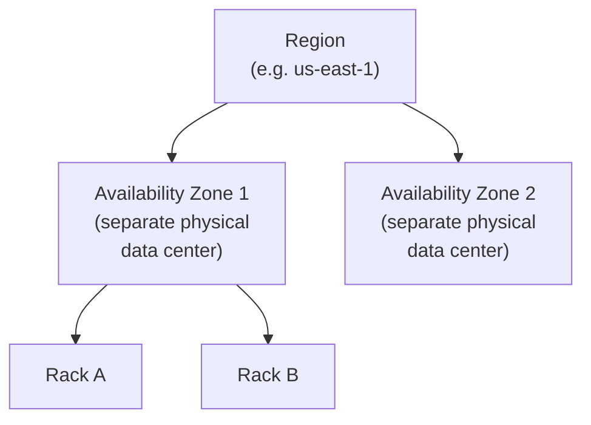
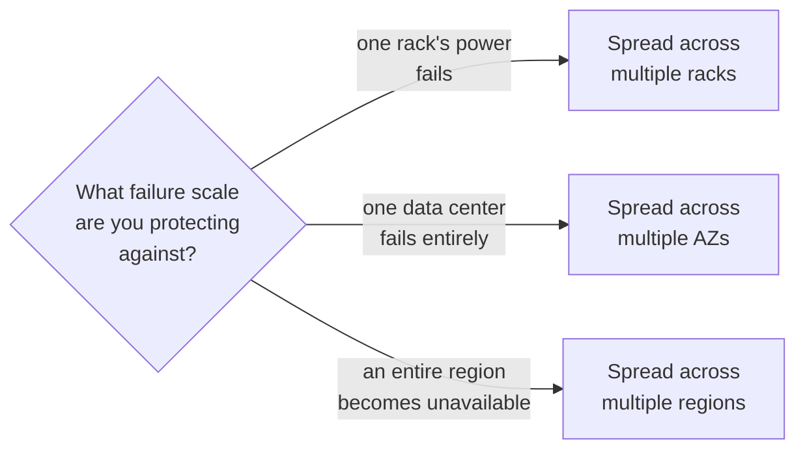

# Redundancy & Failure Domains — Middle

<!-- level-focus -->
At middle level, focus on this question:

> How do real cloud infrastructure boundaries (rack, availability zone,
> region) map onto the failure domains you actually need to design around?

Prerequisite: [`junior.md`](junior.md).

---

## The nested hierarchy of cloud failure domains

| Level | What's shared within it | Protects against |
|---|---|---|
| **Rack** | Power circuit, top-of-rack network switch | A single rack's power/network failure |
| **Availability Zone (AZ)** | Physical building, local power grid, local cooling | An entire data center's failure (fire, flood, power grid outage) |
| **Region** | The cloud provider's regional control plane, regional network backbone | A regional-scale event, or a regional service/control-plane outage |

## Matching redundancy strategy to the failure you're protecting against

Most cloud-native architectures default to **multi-AZ** redundancy (the
standard, well-supported baseline most managed services provide) —
protecting against data-center-level failures, which are common enough to
matter but don't require the added latency and consistency complexity of
multi-region replication (per the CAP theorem trade-offs covered
elsewhere in this tree). **Multi-region** is reserved for systems needing
protection against regional-scale events or specific regulatory/compliance
requirements (data residency, disaster recovery mandates), because it adds
real architectural complexity (see Deployment Stamps & Geodes) that isn't
always justified.

> 🎓 **Takeaway:** "redundant" isn't a single, binary property — it's
> always redundant **at a specific level** (rack, AZ, region), and you
> should choose that level deliberately based on the actual failure
> scenarios your system needs to survive, not default to the maximum level
> "just in case" without weighing the added complexity and cost.

## Test yourself

1. Why is multi-AZ the common default for most cloud-native systems,
   rather than multi-region?
2. What real failure scenario would multi-AZ redundancy NOT protect
   against, that multi-region would?
3. For a system with a strict regulatory requirement to survive a
   regional disaster, what redundancy level would you design for, and
   what added complexity would you accept as the cost?

Continue to [`senior.md`](senior.md).
