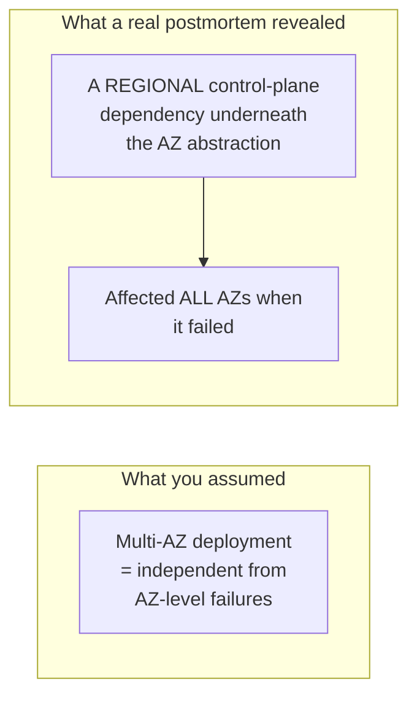

# Redundancy & Failure Domains — Professional

<!-- level-focus -->
At professional level, focus on this question:

> What do real, documented major cloud outages teach about designing
> failure domains that hold up against both infrastructure and
> operational correlated failures?

Prerequisite: [`senior.md`](senior.md).

---

## Documented pattern: regional control-plane dependencies

Multiple major cloud providers' public post-incident reports document
outages where a **regional** (not zonal) control-plane component — a
networking configuration service, a regional DNS resolution path, an
internal service-discovery system — caused a multi-AZ outage that
customers' "multi-AZ redundant" architectures could not survive, because
the affected component sat **below** the AZ abstraction customers were
designing redundancy around. The professional-level lesson, directly
informed by these public postmortems: **verify which specific services
your redundancy assumes are AZ-scoped are actually documented as
AZ-scoped by your cloud provider**, rather than assuming based on the
service's marketing description — some managed services have regional
control-plane dependencies that aren't obvious from their primary data-plane
architecture.



## Documented pattern: cascading dependency failures during recovery

Several documented major outages show a specific pattern: the initial
failure is contained and recovers, but the **recovery process itself**
(every affected service simultaneously reconnecting, re-establishing
state, re-registering with a coordination service) creates a **secondary**
overload — directly the thundering-herd pattern from the Coordination
Services professional page and the Retries & Idempotency professional
page's retry-storm discussion, but occurring specifically during recovery
from a failure-domain-level incident, not just from an application
restart. The professional-level design response: **stagger recovery**
explicitly (don't let every affected component reconnect/retry
simultaneously the instant the underlying issue resolves) using the same
jittered-backoff discipline applied throughout this reliability-patterns
folder.

## Practical failure-domain design checklist, informed by real incidents

1. **Verify AZ/region scoping of every managed service dependency**
   against your cloud provider's documented architecture, not assumptions —
   check specifically for services with known regional control-plane
   dependencies.
2. **Identify and redundantly provision shared external dependencies**
   (DNS providers, certificate authorities, third-party auth providers) as
   their own failure domain — these sit outside your cloud provider's own
   AZ/region boundaries entirely and are a documented root cause of
   "everything is down" incidents despite solid internal redundancy.
3. **Never deploy configuration or code changes to 100% of your failure
   domains simultaneously** — staged/canary rollouts are a direct
   mitigation against the correlated-operational-failure risk from
   `senior.md`.
4. **Design and test recovery-time behavior explicitly**, not just
   failure-time behavior — a game day should specifically simulate "the
   underlying issue just resolved, now everything reconnects at once" to
   validate your jittered-reconnection and backpressure mechanisms hold up
   during recovery, not just during the initial failure.
5. **Read your cloud provider's public postmortems for major past
   incidents affecting your region/services** as a standing practice, and
   explicitly map each documented failure pattern against your own
   architecture's exposure — this is a concrete, actionable way to apply
   real industry incident data to your own resilience design.

## Cheat Sheet

```text
+------------------------------------------------------------------+
|      REDUNDANCY & FAILURE DOMAINS — INTERNALS & SCALE                |
+------------------------------------------------------------------+
| Physical failure domains (rack/AZ/region) protect against              |
| INFRASTRUCTURE failures (power, cooling, physical damage) - they       |
| provide NO protection against correlated SOFTWARE/OPERATIONAL          |
| failures (bad global deploy, shared third-party outage, common bug)   |
+------------------------------------------------------------------+
| Documented real-world pattern: a REGIONAL control-plane dependency     |
| hiding beneath an assumed-independent AZ abstraction can undermine      |
| multi-AZ redundancy entirely - VERIFY AZ/region scoping against         |
| provider documentation, don't assume from a service's marketing        |
+------------------------------------------------------------------+
| Documented real-world pattern: RECOVERY ITSELF can cause a secondary   |
| overload (thundering herd of simultaneous reconnects) - stagger        |
| recovery explicitly with the same jittered-backoff discipline used     |
| throughout this reliability-patterns folder                            |
+------------------------------------------------------------------+
| Mitigate correlated operational failures: staged/canary deploys,       |
| never 100% of failure domains at once; redundant provisioning of        |
| shared EXTERNAL dependencies (DNS, cert authorities) as their own       |
| failure domain                                                        |
+------------------------------------------------------------------+
```

## Test yourself

1. Why can a managed cloud service's "multi-AZ" architecture still have a
   hidden regional single point of failure, and how would you verify
   whether a specific service you depend on has this risk?
2. Why does the recovery moment after a major outage often create its own
   secondary incident, and what specific mitigation from earlier in this
   folder applies here?
3. Design a game-day exercise that specifically tests your system's
   behavior during the recovery/reconnection phase after a simulated
   AZ-level outage, not just during the outage itself.

## Further Reading

- AWS, Google Cloud, and Azure public post-incident summaries (search each
  provider's status/incident history pages) — read several in full for
  documented regional-control-plane and cascading-recovery patterns.
- Google SRE Workbook — Chapter 8, "Postmortem Culture" (learning from
  documented incidents as a discipline).
- See also: [Coordination Services — professional](../../18-concurrency-coordination/05-coordination-services/professional.md)
  (thundering herd), [Deployment Stamps & Geodes — professional](../08-deployment-stamps-and-geodes/professional.md).
