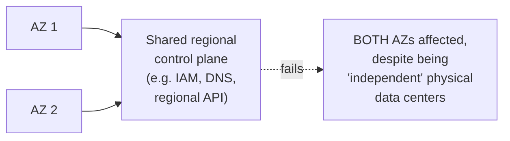
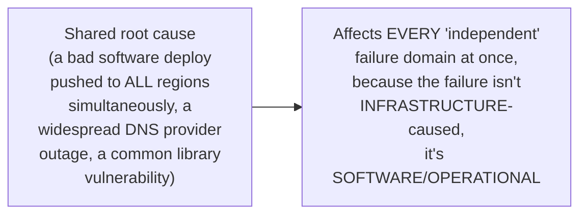

# Redundancy & Failure Domains — Senior

<!-- level-focus -->
At senior level, focus on this question:

> How can failures correlate across failure domains that are supposed to
> be independent?

Prerequisite: [`middle.md`](middle.md).

---

## Failure domains aren't always as independent as their names suggest

Two AZs are physically independent buildings, but they may still share a
**regional control plane** — a regional API service, a regional DNS
resolution path, a regional identity/authentication service — that, if it
fails, can affect every AZ in that region simultaneously, despite the AZs'
physical independence. This is a real, repeatedly-documented failure
pattern in major cloud providers' post-incident reports: a "multi-AZ"
architecture assumed independence that turned out not to fully hold,
because the *control plane* managing those AZs was itself a shared,
regional-scope dependency.

## Correlated failures from shared root causes

Physical failure domains (rack, AZ, region) protect against
**infrastructure**-caused failures (power, cooling, physical damage) — but
they provide **no** protection against a correlated **software** or
**operational** failure: a bad configuration change deployed globally, a
widely-used third-party service (DNS, a certificate authority, a CDN)
having its own outage, or a common software bug present in every instance
regardless of which physical failure domain it runs in. These are real,
frequently-documented root causes of major multi-region outages, precisely
because they bypass physical failure-domain isolation entirely.

> 🎯 **Senior takeaway:** physical failure-domain separation (rack, AZ,
> region) is necessary but not sufficient — it protects against
> infrastructure failures, but a correlated software/operational failure
> (a bad global deploy, a shared third-party dependency's outage) can
> still take down every "independent" domain simultaneously. Real
> resilience requires **also** protecting against these operational
> correlation risks: staged/canary deploys (never deploy to 100% of
> regions/AZs at once), and identifying shared external dependencies
> (DNS providers, certificate authorities) as their own failure domain
> requiring redundancy too.

## Test yourself

1. Why does a shared regional control plane undermine the independence
   multi-AZ redundancy is supposed to provide?
2. Give an example of a software or operational failure that could affect
   every "independent" failure domain in your architecture simultaneously.
3. Why does a staged/canary deployment strategy (never deploying to 100%
   at once) act as a mitigation against correlated operational failures,
   even when your physical failure-domain redundancy is otherwise solid?

Continue to [`professional.md`](professional.md) to design failure-domain
strategy for real production infrastructure, accounting for documented
correlated-failure incidents.
