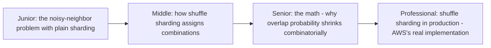
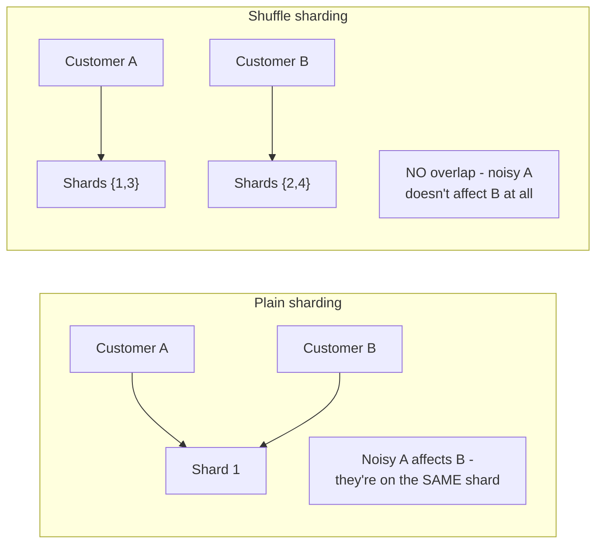

# Shuffle Sharding

> A clever combinatorial trick: instead of assigning each customer to one
> shared shard (where a noisy neighbor on that shard affects everyone else
> on it), assign each customer a unique, random *combination* of resources
> — dramatically shrinking the odds that any two customers fully overlap.

## Choose a level

| Level | Guide | You are done when |
|---|---|---|
| Junior | [The noisy-neighbor problem](junior.md) | You can explain why plain sharding still lets one customer affect others sharing their shard. |
| Middle | [Assigning combinations](middle.md) | You can trace how a customer gets assigned a unique combination of shards. |
| Senior | [The combinatorial math](senior.md) | You can compute the probability of full overlap between two customers' shard combinations. |
| Professional | [Shuffle sharding in production](professional.md) | You can explain AWS's real documented use of shuffle sharding and its failure-isolation guarantees. |

## Practice rule

For any multi-tenant system using plain sharding, ask: "if two customers
land on the exact same shard, and one is noisy, does the other suffer?" If
yes, and full noisy-neighbor isolation matters for your SLA, shuffle
sharding is the pattern that fixes it without needing a fully dedicated
shard per customer.

## Related

- [Partitioning & Sharding](../../../databases/scaling/17-partitioning-and-sharding/README.md)
- [Bulkhead](../02-bulkhead/README.md)
