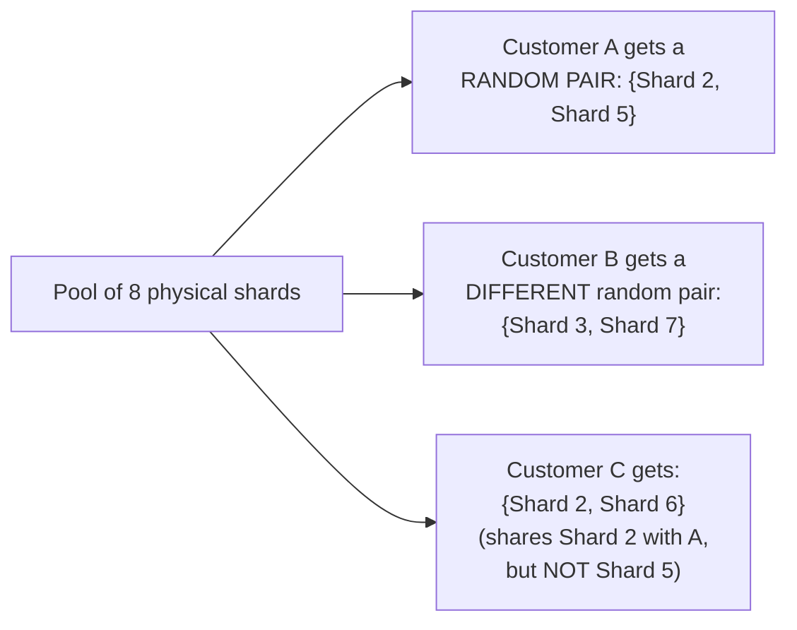
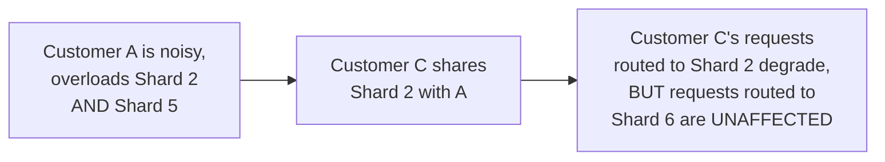

# Shuffle Sharding — Middle

<!-- level-focus -->
At middle level, focus on this question:

> How does assigning each customer a random combination of shards, instead
> of a single shard, actually work?

Prerequisite: [`junior.md`](junior.md).

---

## Assigning combinations, not single shards



Instead of assigning each customer to **one** shard from a pool of `N`,
shuffle sharding assigns each customer a **random subset** (e.g. 2 out of
8) of shards, and routes that customer's requests across **all** shards in
their assigned subset (e.g. round-robin, or using both for redundancy).

```python
import random

def assign_shuffle_shard(customer_id, total_shards=8, shard_count=2):
    rng = random.Random(customer_id)  # deterministic per customer
    return rng.sample(range(total_shards), shard_count)

# Customer A: [2, 5]
# Customer B: [3, 7]
# Customer C: [2, 6]  <- shares ONE shard (2) with Customer A, not both
```

## Why partial overlap doesn't mean full impact



Even if Customer C happens to share **one** shard with a noisy Customer A,
C's traffic isn't entirely dependent on that one shard — it's spread
across C's **whole** assigned combination `{2, 6}`. Only requests
specifically routed to the shared Shard 2 are affected; requests to Shard
6 continue working normally. This partial-overlap resilience is the key
mechanism `senior.md` will quantify.

> 🎓 **Takeaway:** shuffle sharding's core trick is that even when two
> customers' combinations partially overlap (which will happen sometimes,
> by design, since there are finitely many shards), a noisy customer on
> one shared shard degrades only a **fraction** of the other customer's
> traffic, not all of it — a meaningfully different, much better outcome
> than plain sharding's "fully shared or fully isolated" binary.

## Test yourself

1. Why does Customer C in the example above only experience partial
   degradation, rather than full degradation, from sharing one shard with
   noisy Customer A?
2. Why must the random assignment be **deterministic per customer** (using
   the customer ID as a seed) rather than truly random on every request?
3. If two customers happen to be assigned the exact same combination of
   shards (both get `{2, 5}`), what happens to the isolation guarantee for
   those two specific customers?

Continue to [`senior.md`](senior.md).
