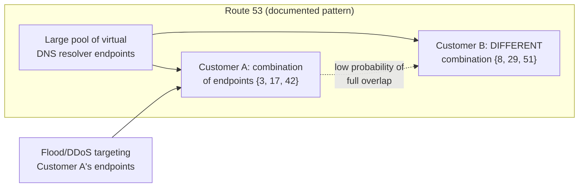
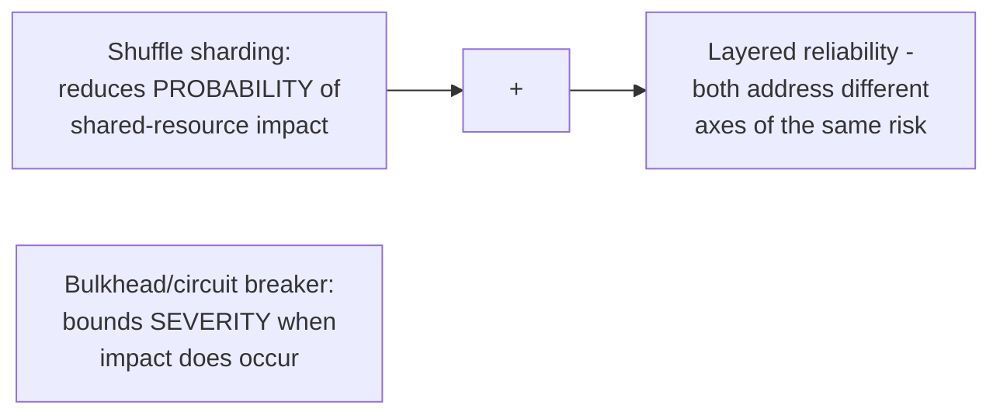

# Shuffle Sharding — Professional

<!-- level-focus -->
At professional level, focus on this question:

> How does AWS actually use shuffle sharding in production (Route 53,
> and their documented general guidance), and how does it compose with
> other patterns from this whole reliability-patterns folder?

Prerequisite: [`senior.md`](senior.md).

---

## AWS Route 53's documented use: DNS resolver endpoints

AWS's own engineering writing (notably a widely-cited post by AWS
Distinguished Engineer Colm MacCárthaigh) documents shuffle sharding as
the technique behind Route 53's resilience to targeted or accidental
customer-triggered network floods: each customer's DNS queries are
"handled by a *different* combination of virtual Route 53 servers" out of
a larger pool, so a flood of traffic (legitimate or a DDoS) affecting one
customer's specific server combination has a mathematically small chance
(per `senior.md`'s combinatorics) of affecting any **other specific**
customer's fully-distinct combination — a real, production-proven
application of exactly this pattern at internet scale, chosen specifically
because dedicating an entire physical server per customer would be
infeasible at Route 53's customer count.



## Composing shuffle sharding with bulkheading

Shuffle sharding is, at its core, a **statistical bulkheading** strategy —
rather than a hard, deterministic partition (bulkhead's per-dependency
pool), it uses combinatorics to make the probability of shared-resource
impact between any two specific tenants small. The professional-level
synthesis: shuffle sharding is most powerful when **each individual shard
in the pool is itself further protected by bulkheading/circuit-breaking**
(covered earlier in this folder) — shuffle sharding reduces the
**probability** that a noisy neighbor affects you at all, while
bulkheading/circuit-breaking bounds the **severity** if it does happen
anyway (the rare full-overlap case, or even a partial-overlap case, per
`senior.md`). These patterns are complementary, not alternatives — a
mature reliability architecture layers them together.



## Tuning `k` (shards per customer) against redundancy needs

Beyond isolation, `k > 1` also provides built-in redundancy: if one shard
in a customer's assigned combination becomes unavailable, requests can
still route through the customer's **other** assigned shard(s) — this
means the choice of `k` is simultaneously a noisy-neighbor-isolation
tuning knob (`senior.md`'s combinatorics) and a redundancy/availability
tuning knob, and production systems must balance both considerations
together rather than optimizing for isolation alone.

## Production checklist (staff-level)

1. **Consider shuffle sharding specifically for multi-tenant systems where
   noisy-neighbor isolation matters for your SLA, but a fully dedicated
   shard per tenant is infeasible at your scale/cost** — this is the exact
   gap the pattern is designed to fill.
2. **Tune `N` (pool size) and `k` (shards per customer) together against
   your actual tenant count and target full-overlap probability**, using
   the combinatorics from `senior.md`, not arbitrary defaults.
3. **Layer shuffle sharding with bulkheading/circuit-breaking at the
   individual-shard level**, treating them as complementary (probability
   reduction + severity bounding), not redundant or competing patterns.
4. **Use `k > 1` deliberately for its redundancy benefit**, not just
   isolation — a customer's combination surviving a single shard failure
   is a real availability benefit worth factoring into the `k` choice.
5. **In a design review for a new multi-tenant shared-infrastructure
   system, require an explicit noisy-neighbor risk analysis** — if it's a
   real concern and dedicated-per-tenant infrastructure isn't affordable,
   shuffle sharding should be evaluated explicitly as the documented,
   production-proven middle-ground solution.

## Cheat Sheet

```text
+------------------------------------------------------------------+
|              SHUFFLE SHARDING — INTERNALS & SCALE                    |
+------------------------------------------------------------------+
| AWS Route 53 (documented, real production use): each customer's       |
| DNS queries handled by a DIFFERENT COMBINATION of resolver endpoints  |
| out of a large pool - a flood/DDoS on one customer's combination has  |
| mathematically small probability of hitting another specific          |
| customer's fully distinct combination                                 |
+------------------------------------------------------------------+
| Shuffle sharding = STATISTICAL bulkheading (reduces PROBABILITY of     |
| shared-resource impact) - complements, doesn't replace, per-shard      |
| bulkheading/circuit-breaking (bounds SEVERITY when impact occurs)      |
| Layer both together for a mature reliability architecture              |
+------------------------------------------------------------------+
| k (shards per customer) is BOTH an isolation tuning knob (senior.md's  |
| combinatorics) AND a redundancy knob (surviving one shard's failure    |
| via the customer's other assigned shards) - balance both, don't        |
| optimize for isolation alone                                          |
+------------------------------------------------------------------+
```

## Test yourself

1. Why did AWS choose shuffle sharding for Route 53 instead of dedicating
   a physical server per customer, given their customer count?
2. Explain why shuffle sharding and bulkheading are complementary rather
   than redundant — what different axis of risk does each address?
3. Design the `N` and `k` parameters for a multi-tenant system with 10,000
   tenants, targeting a full-overlap probability below 0.01% between any
   two tenants, while also wanting each tenant to survive a single shard
   outage.

## Further Reading

- Colm MacCárthaigh (AWS) — "Shuffle Sharding: massive and magical
  fault isolation" (the original, widely-cited AWS engineering blog post
  describing Route 53's production use).
- AWS Builders' Library — "Workload isolation using shuffle-sharding."
- See also: [Bulkhead — professional](../02-bulkhead/professional.md),
  [Partitioning & Sharding — professional](../../../databases/scaling/17-partitioning-and-sharding/professional.md).
