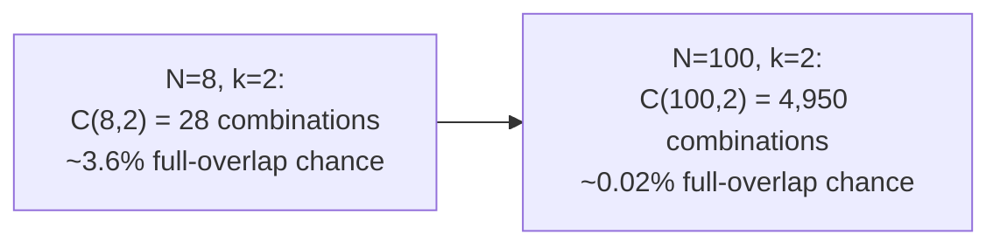
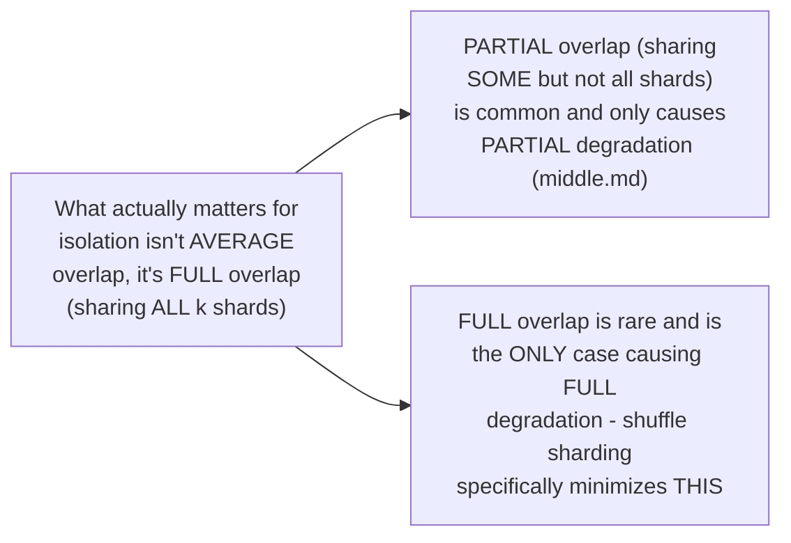

# Shuffle Sharding — Senior

<!-- level-focus -->
At senior level, focus on this question:

> How does the probability of two customers fully overlapping shrink
> combinatorially as you increase the shard pool size?

Prerequisite: [`middle.md`](middle.md).

---

## The combinatorics

If there are `N` total shards and each customer is assigned a combination
of `k` shards, the number of **possible distinct combinations** is
`C(N, k)` ("N choose k"). The probability that two **independently and
randomly assigned** customers get the **exact same** combination (full
overlap — the worst case, equivalent to plain sharding for that pair) is
`1 / C(N, k)`.

```
N = 8 shards, k = 2 per customer
C(8, 2) = 28 possible combinations
Probability of full overlap between any two customers = 1/28 ≈ 3.6%
```



Growing the shard pool size `N` (while keeping `k` fixed) shrinks the
full-overlap probability **combinatorially**, not linearly — doubling `N`
from 8 to 16 doesn't just double the number of combinations, it roughly
**quadruples** it (`C(16,2) = 120` vs `C(8,2) = 28`), because the
combination count grows quadratically (for `k=2`) or faster with `N`.

## Why this matters more than it looks



The senior-level insight: shuffle sharding doesn't try to eliminate all
overlap (with a finite shard pool, some overlap is mathematically
unavoidable) — it specifically minimizes the probability of **complete**
overlap, because partial overlap only causes partial, bounded degradation
(`middle.md`), while full overlap reproduces plain sharding's full-impact
noisy-neighbor problem for that specific pair. This distinction — optimizing
for "rare full overlap" rather than "zero overlap" — is what makes the
pattern practical with a realistically-sized shard pool, rather than
requiring an impractically large one.

> 🎯 **Senior takeaway:** the value of shuffle sharding scales with your
> shard pool size and how many shards you assign per customer (`k`) —
> tune `N` and `k` together against your actual customer count and
> acceptable full-overlap probability, understanding that the protection
> is probabilistic (rare bad luck is still possible) rather than an
> absolute guarantee, unlike a fully dedicated shard per customer.

## Test yourself

1. Compute `C(N, k)` for `N=20, k=3` and explain what this number
   represents.
2. Why does increasing `N` reduce full-overlap probability faster than
   linearly?
3. Why is minimizing full overlap (not all overlap) the right target,
   given that partial overlap only causes bounded, partial degradation?

Continue to [`professional.md`](professional.md) to see AWS's real,
documented production use of shuffle sharding.
