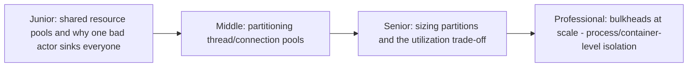
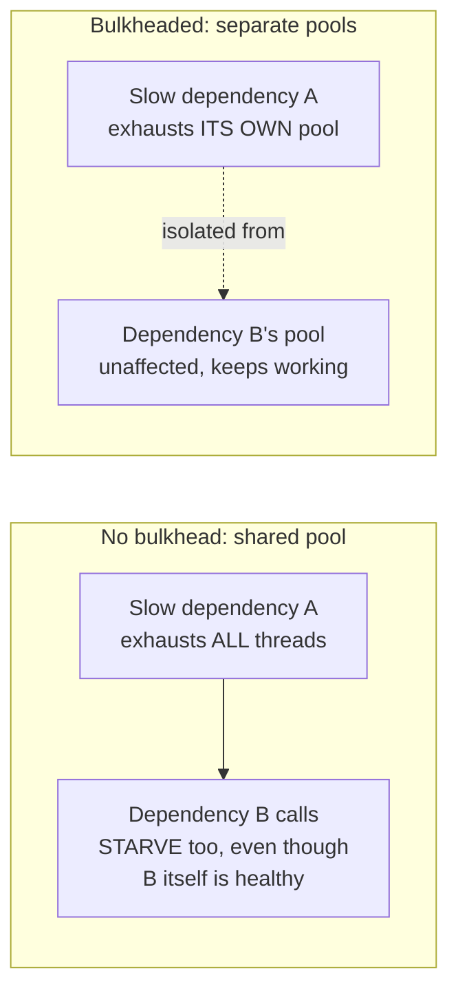

# Bulkhead

> Named after a ship's watertight compartments: partition resources (thread
> pools, connections, capacity) so that one failing or overloaded
> consumer can't sink the whole system by exhausting a shared resource pool
> everyone depends on.

## Choose a level

| Level | Guide | You are done when |
|---|---|---|
| Junior | [Shared pools and why one bad actor sinks everyone](junior.md) | You can explain how a slow dependency can starve unrelated calls sharing the same thread pool. |
| Middle | [Partitioning pools](middle.md) | You can design separate thread/connection pools per dependency. |
| Senior | [Sizing partitions](senior.md) | You can explain the utilization trade-off between many small partitions and one large shared pool. |
| Professional | [Bulkheads at scale](professional.md) | You can design process/container-level isolation as a stronger bulkhead than in-process pool partitioning. |

## Practice rule

For any shared resource pool (threads, connections, memory) in your
system, ask: "if one specific dependency this pool serves became
arbitrarily slow, would it consume the entire pool and starve every other
dependency sharing it?" If yes, you need a bulkhead.

## Related

- [Circuit Breaker](../circuit-breaker/README.md)
- [Connection Pooling](../../../databases/operation/connection-pooling/README.md)
