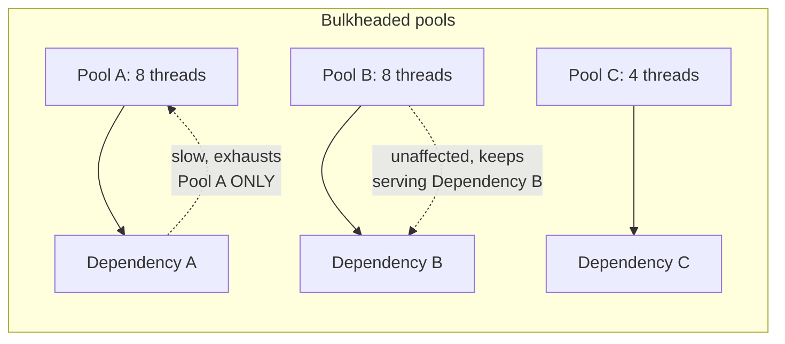
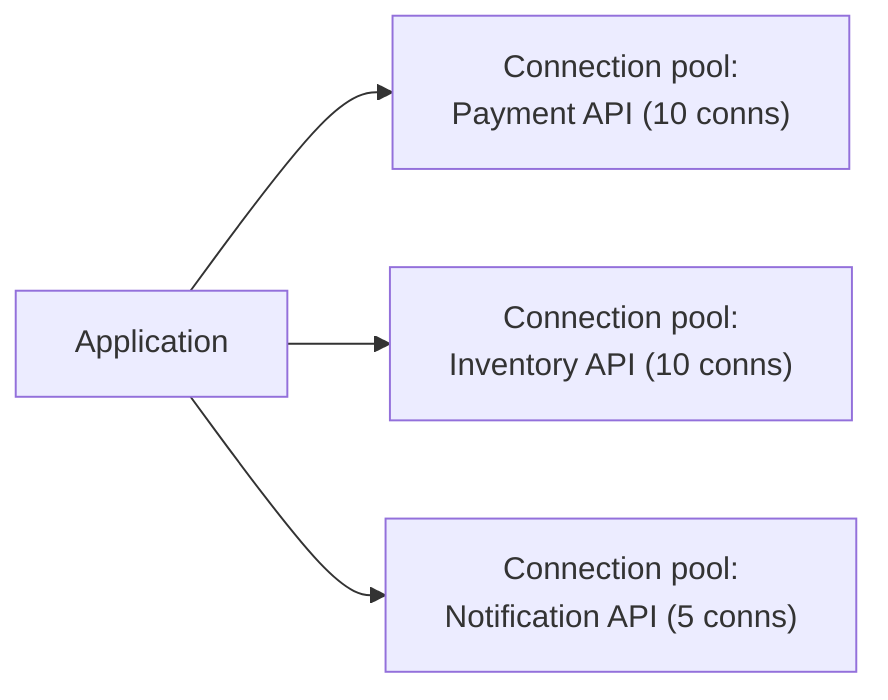

# Bulkhead — Middle

<!-- level-focus -->
At middle level, focus on this question:

> How do you actually partition thread and connection pools per dependency
> in practice?

Prerequisite: [`junior.md`](junior.md).

---

## Separate thread pools per dependency

```python
# Instead of one shared executor for everything:
shared_executor = ThreadPoolExecutor(max_workers=20)

# Bulkheaded: one pool per dependency, sized independently
dependency_a_pool = ThreadPoolExecutor(max_workers=8)
dependency_b_pool = ThreadPoolExecutor(max_workers=8)
dependency_c_pool = ThreadPoolExecutor(max_workers=4)

def call_dependency_a():
    return dependency_a_pool.submit(actual_call_to_a).result()
```



Now, if Dependency A becomes slow and exhausts its 8-thread pool, calls to
Dependency B and C are completely unaffected — they have their own,
separate allocation that A's problem can never touch.

## Connection pool bulkheading follows the same principle

The same idea applies to database/HTTP connection pools (see
[Connection Pooling](../../../databases/operation/connection-pooling/README.md)):
a service calling three different downstream APIs should generally use
**three separate connection pools**, not one shared pool sized for the sum
of all three — otherwise the exact same starvation dynamic from
`junior.md` applies to connections instead of threads.



> 🎓 **Takeaway:** bulkheading is a straightforward, mechanical
> application of "don't share a limited resource across independent
> failure domains" — the pattern generalizes to any resource pool (threads,
> connections, even separate deployment instances for critical vs.
> non-critical traffic), not just thread pools specifically.

## Test yourself

1. Why is a single shared connection pool for three unrelated downstream
   APIs vulnerable to the exact same problem as a single shared thread
   pool?
2. If you have 20 total threads available and three dependencies with very
   different call volumes, would you split them evenly (7/7/6), or based
   on something else? What would you base the split on?
3. What's the cost of bulkheading compared to one shared pool — is there a
   downside to always partitioning aggressively?

Continue to [`senior.md`](senior.md).
