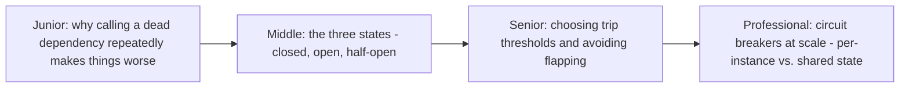
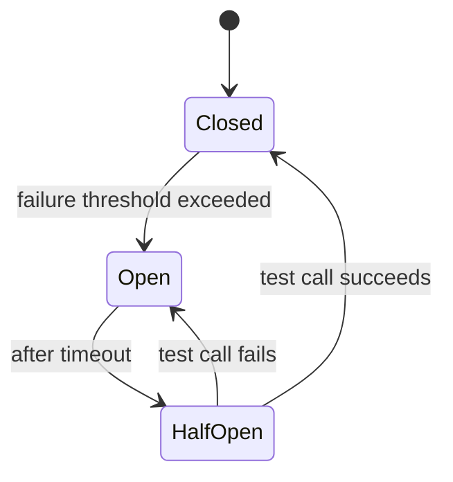

# Circuit Breaker

> Stop calling a dependency that's clearly failing, instead of retrying it
> into the ground. A circuit breaker trips open after enough failures, fails
> fast while open, and periodically tests whether the dependency has
> recovered — the coarse-grained complement to the fine-grained retry budget.

## Choose a level

| Level | Guide | You are done when |
|---|---|---|
| Junior | [Why calling a dead dependency repeatedly hurts](junior.md) | You can explain why continuing to call a failing dependency can make its recovery slower. |
| Middle | [Closed, open, half-open](middle.md) | You can trace a circuit breaker through all three states with a concrete failure/recovery scenario. |
| Senior | [Thresholds and flapping](senior.md) | You can explain what causes a circuit breaker to flap open/closed repeatedly, and how to prevent it. |
| Professional | [Circuit breakers at scale](professional.md) | You can design shared circuit-breaker state across a fleet of service instances. |

## Practice rule

For any external dependency call, ask: "if this dependency goes down for 10
minutes, does my system keep hammering it with the same request volume the
whole time, or does something make it back off?" If the answer is "keeps
hammering," you don't have a circuit breaker, whatever your retry logic
looks like.

## Related

- [Retries & Idempotency](../../../schedule-jobs/retries-and-idempotency/README.md)
- [Bulkhead](../bulkhead/README.md)
- [Health Endpoint Monitoring](../health-endpoint-monitoring/README.md)
