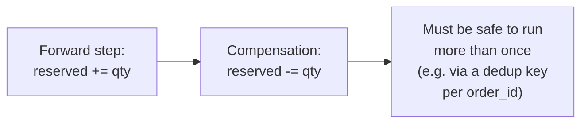
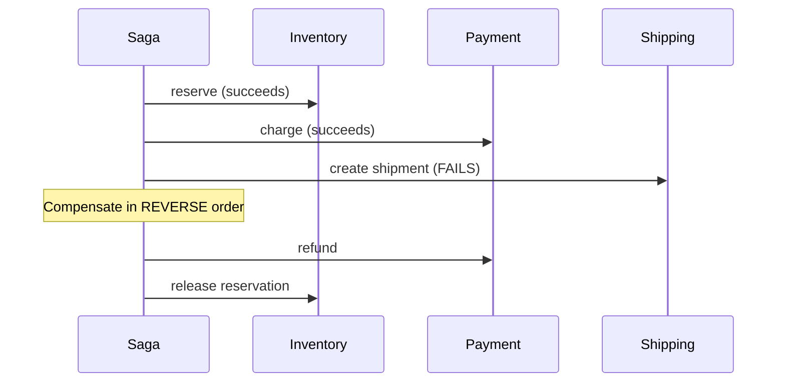

# Compensating Transaction — Middle

<!-- level-focus -->
At middle level, focus on this question:

> How do you design a compensating action for a specific, already-committed
> step?

Prerequisite: [`junior.md`](junior.md).

---

## The design checklist per step

For each step in a multi-step process, design its compensation by asking:

1. **What did this step change, concretely?**
2. **What action returns the system to an equivalent business state?**
3. **Is the compensation itself idempotent and retryable** (per
   [Retries & Idempotency](../../17-background-jobs/retries-and-idempotency/README.md))?

```python
# Forward step
def reserve_inventory(order_id, sku, qty):
    db.execute(
        "UPDATE inventory SET reserved = reserved + %s WHERE sku = %s",
        qty, sku
    )

# Compensating action - the inverse EFFECT, not a magic "undo"
def release_inventory_reservation(order_id, sku, qty):
    db.execute(
        "UPDATE inventory SET reserved = reserved - %s WHERE sku = %s",
        qty, sku
    )
```



## Compensation order: reverse of execution order



Compensations run in the **reverse** order of the forward steps —
undoing the most recently completed step first, then working backward,
mirroring how a stack unwinds. This matters because later steps can
sometimes depend on earlier ones' effects still being in place until
they're specifically compensated.

> 🎓 **Takeaway:** designing a compensation is a per-step exercise:
> identify the concrete state change, design the inverse-effect action,
> and make that action idempotent — then chain compensations in reverse
> execution order when a multi-step process needs to unwind.

## Test yourself

1. Why must the `release_inventory_reservation` compensation also be
   idempotent, not just the forward `reserve_inventory` step?
2. Why do compensations run in reverse order rather than forward order or
   some other order?
3. Design the compensation for a "send a push notification" step — is
   this step even compensatable, or does it belong to a different category
   entirely?

Continue to [`senior.md`](senior.md).
