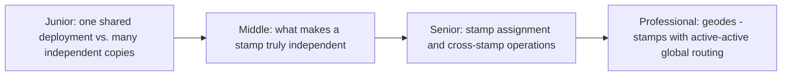
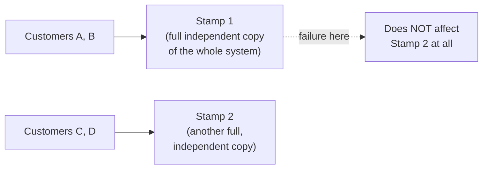

# Deployment Stamps & Geodes

> Instead of one giant, shared deployment serving every customer, deploy
> multiple independent, identical copies ("stamps") — each self-contained,
> each a full failure domain of one. The architecture behind "your outage
> only affects your stamp, not the whole platform."

## Choose a level

| Level | Guide | You are done when |
|---|---|---|
| Junior | [One shared deployment vs. many stamps](junior.md) | You can explain why a single shared deployment's outage affects every customer at once. |
| Middle | [What makes a stamp truly independent](middle.md) | You can identify a shared dependency that would silently break stamp isolation. |
| Senior | [Stamp assignment and cross-stamp operations](senior.md) | You can design how a customer gets assigned to a stamp, and handle operations that must span stamps. |
| Professional | [Geodes and active-active routing](professional.md) | You can design a geode architecture routing users to their nearest healthy stamp. |

## Practice rule

For any "stamp" or region-isolated deployment, ask: "does this stamp share
a single database, a single message broker, or a single coordination
service with any other stamp?" If yes, that shared component is a hidden
cross-stamp failure domain undermining the whole point of stamping.

## Related

- [Redundancy & Failure Domains](../redundancy-and-failure-domains/README.md)
- [Database Federation](../../../databases/scaling/database-federation/README.md)
