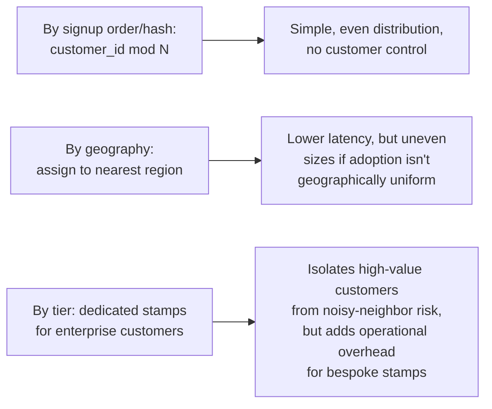
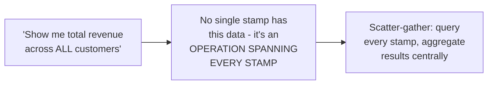

# Deployment Stamps & Geodes — Senior

<!-- level-focus -->
At senior level, focus on this question:

> How do you assign customers to stamps, and how do you handle an
> operation that genuinely needs to span multiple stamps?

Prerequisite: [`middle.md`](middle.md).

---

## Stamp assignment strategies

The assignment strategy directly determines what kind of isolation you
actually get: hash-based assignment gives even load distribution but no
geographic locality; geography-based assignment improves latency but can
create uneven stamp sizes; tier-based assignment (a dedicated stamp for a
single large enterprise customer) provides the strongest isolation for
that customer, at real operational cost of managing a bespoke, low-
customer-count stamp.

## Cross-stamp operations: the hard part

Some operations (a company-wide analytics report, a global search, a
cross-customer admin action) genuinely need data from **every** stamp —
this requires a **scatter-gather** query pattern (see
[Scatter-Gather Aggregator](../../distributed-transaction/scatter-gather-aggregator/README.md)):
fan out to every stamp, collect results, aggregate centrally. This is a
deliberate, explicit architectural exception to stamping's isolation
principle, and it should be **rare** and **clearly identified** — every
cross-stamp operation is a place where a problem in one stamp (unavailable,
slow) can degrade an operation that touches every customer, partially
reintroducing the shared blast radius stamping was meant to eliminate.

> 🎯 **Senior takeaway:** stamp assignment strategy is a real design
> decision with load-distribution and isolation trade-offs, not an
> afterthought. Cross-stamp operations are the necessary exception to
> stamping's isolation guarantee — minimize their number, design them to
> degrade gracefully (partial results if one stamp is unreachable, rather
> than failing the whole aggregate query), and treat every one as a
> deliberate, reviewed architectural decision.

## Test yourself

1. Why does hash-based stamp assignment give even load distribution but
   sacrifice geographic locality, compared to geography-based assignment?
2. Why is a scatter-gather query across every stamp a partial reintroduction
   of the shared-blast-radius problem stamping is meant to solve?
3. Design a cross-stamp analytics query that degrades gracefully (returns
   partial results with a clear indicator) if one stamp is temporarily
   unreachable, rather than failing the entire report.

Continue to [`professional.md`](professional.md) to design geode
architecture with active-active global routing.
