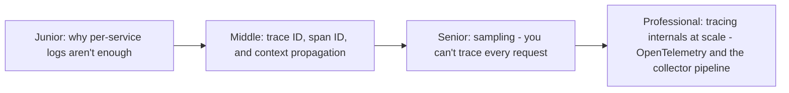
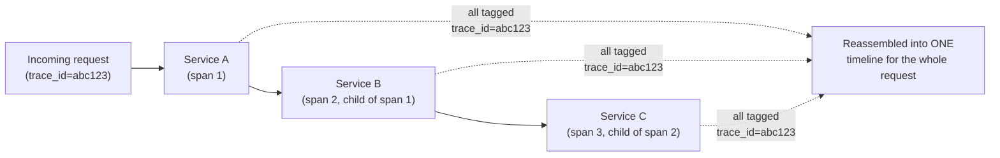

# Distributed Tracing

> A single user request can fan out across dozens of services — distributed
> tracing stitches every hop back together into one coherent timeline, by
> propagating a shared trace ID and recording a "span" for each unit of
> work, so you can actually answer "where did the time go?"

## Choose a level

| Level | Guide | You are done when |
|---|---|---|
| Junior | [Why per-service logs aren't enough](junior.md) | You can explain why correlating logs across services manually doesn't scale. |
| Middle | [Trace ID, span ID, propagation](middle.md) | You can trace how a trace ID propagates across an HTTP call boundary. |
| Senior | [Sampling](senior.md) | You can explain why you can't trace every request at scale, and how sampling decisions are made. |
| Professional | [OpenTelemetry and the collector pipeline](professional.md) | You can design a production tracing pipeline using OpenTelemetry's collector architecture. |

## Practice rule

For any request spanning more than 2 services, ask: "if this request is
slow, can I currently find out exactly which of the N services (and which
specific operation within that service) is responsible?" If the answer
requires manually correlating timestamps across separate log files, you
need distributed tracing, not just better logging.

## Related

- [Service Mesh](../service-mesh/README.md)
- [Consumer Autoscaling on Lag](../../event-streaming/events/consumer-autoscaling-on-lag/README.md)
