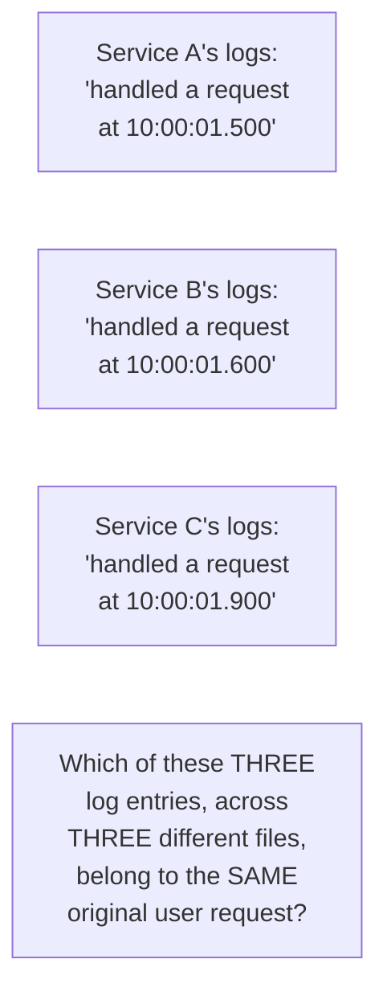
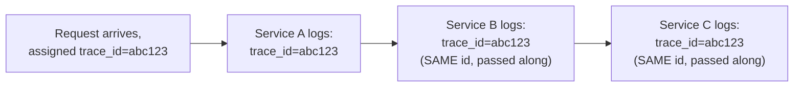

# Distributed Tracing — Junior

<!-- level-focus -->
At junior level, focus on this question:

> Why doesn't checking each service's own logs separately let you
> reconstruct what happened to one specific slow request?

---

## Per-service logs, disconnected

Each service logs its own activity independently, with no shared
identifier connecting a specific log line in Service A to the
corresponding log line in Service B that resulted from the **same**
original request. With many services and high request volume,
timestamps alone are nowhere near enough to reliably reconstruct which
log entries across which services belong to one specific request —
especially when multiple requests are being processed concurrently
across all services at once.

## The fix: a shared trace ID that follows the request everywhere

A single **trace ID** is generated when a request first enters the system,
and every downstream service call **propagates** this same ID along
(typically via an HTTP header) so every service's logs, spans, and
timing data can be tagged with it — letting you query "show me everything
that happened for `trace_id=abc123`" and get a complete, ordered picture
of the entire request's journey across every service it touched.

> 🎓 **Takeaway:** distributed tracing's foundational idea is deceptively
> simple — attach one shared identifier to a request at its entry point,
> and make every service pass that identifier along to every downstream
> call it makes. Everything else in this topic (spans, sampling,
> collectors) builds on this one propagated identifier.

## Test yourself

1. Why is matching log entries across services by timestamp alone
   unreliable at even moderate request volume?
2. What specific piece of information must every service pass along to
   its downstream calls for tracing to work at all?
3. If Service B forgets to propagate the trace ID to Service C, what
   breaks in the resulting trace?

Continue to [`middle.md`](middle.md).
