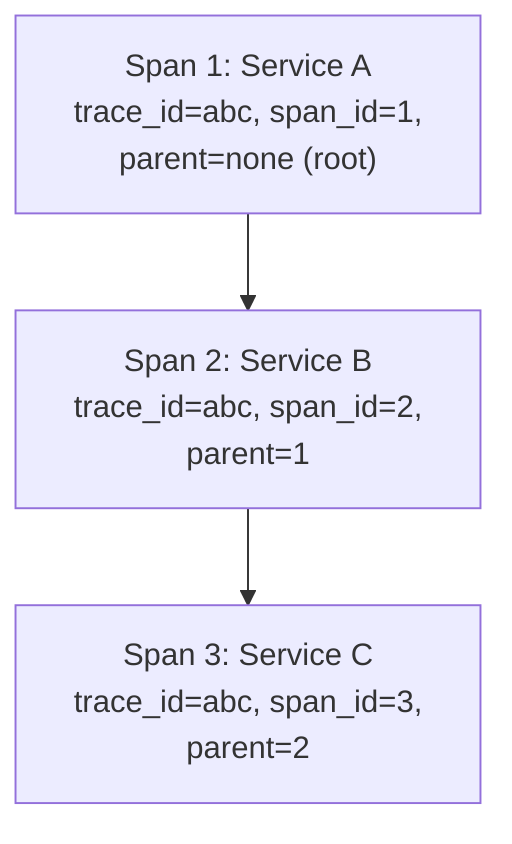
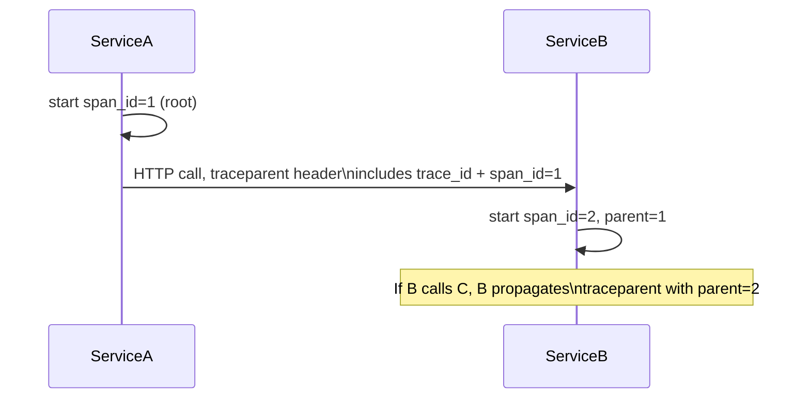

# Distributed Tracing — Middle

<!-- level-focus -->
At middle level, focus on this question:

> How do trace ID, span ID, and parent-span ID combine to reconstruct the
> exact call tree of a distributed request?

Prerequisite: [`junior.md`](junior.md).

---

## Spans: one per unit of work, with parent-child relationships



A **span** represents one unit of work (an HTTP handler, a database
query, a function call you choose to instrument) with a start time, end
time, and metadata. Every span carries the shared **trace ID** plus its
own unique **span ID** and a **parent span ID** pointing to whichever span
caused it — this parent-child chain is what lets a tracing backend
reconstruct the exact **call tree** (not just a flat list of events) for
the whole request.

## Context propagation over HTTP

```http
GET /api/orders/42 HTTP/1.1
traceparent: 00-abc123def456-789xyz-01
```

The W3C **Trace Context** standard defines the `traceparent` header
format (`version-traceID-parentSpanID-flags`) — when Service A calls
Service B, it includes this header; Service B's tracing library extracts
it, creates a new span with `parent = <the incoming parentSpanID>`, and
propagates its **own** new span ID onward to any calls **it** makes,
continuing the chain.



> 🎓 **Takeaway:** the trace ID identifies "which overall request," the
> span ID identifies "which specific piece of work," and the parent-span
> ID reconstructs "which piece of work caused which other piece of work" —
> together, these three pieces of propagated context are sufficient to
> rebuild the complete, ordered, hierarchical timeline of a request across
> any number of services.

## Test yourself

1. Why is a parent-span ID necessary, in addition to the shared trace ID —
   what would be missing if every span only carried the trace ID?
2. Trace through the `traceparent` header propagation for a 4-service call
   chain (A → B → C → D), and identify each span's parent.
3. Why does the W3C Trace Context standard matter for interoperability
   between services written in different languages or using different
   tracing libraries?

Continue to [`senior.md`](senior.md).
