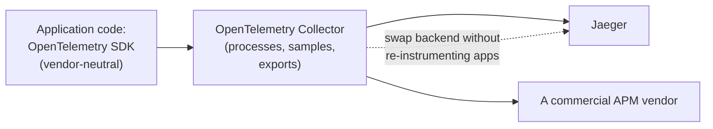
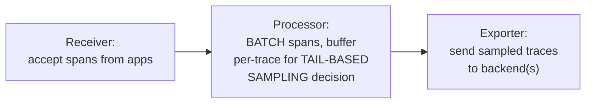
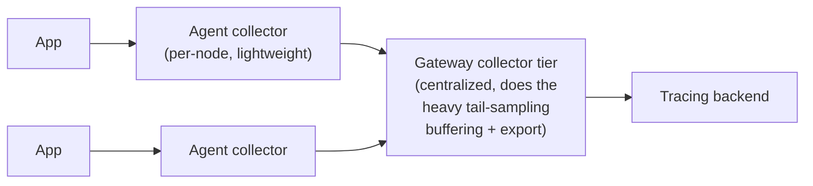

# Distributed Tracing — Professional

<!-- level-focus -->
At professional level, focus on this question:

> How does OpenTelemetry's collector pipeline architecture actually
> implement tail-based sampling and vendor-neutral trace export at
> production scale?

Prerequisite: [`senior.md`](senior.md).

---

## OpenTelemetry: the vendor-neutral instrumentation standard

OpenTelemetry (OTel) standardizes **how** applications generate trace
data (a common API/SDK across languages) and **how** that data is
exported, decoupling application instrumentation from any specific tracing
backend (Jaeger, Zipkin, a commercial APM vendor). This is the direct
analog of the shared retry library principle from the Retry professional
page — instrument once, using a vendor-neutral standard, and swap backend
tooling without re-instrumenting every service.



## The Collector pipeline: receivers, processors, exporters

The **OpenTelemetry Collector** is a separate, deployable process
(often itself run as a sidecar, echoing the Service Mesh professional
page's sidecar pattern) implementing a three-stage pipeline:
**receivers** (accept spans from instrumented applications, in various
protocols), **processors** (batch spans for efficiency, and critically,
implement **tail-based sampling** by buffering spans per-trace until the
trace completes, then applying the keep/discard policy from `senior.md`),
and **exporters** (send the final, sampled data to one or more tracing
backends).



The tail-based sampling processor specifically must buffer **all spans
for a given trace ID** until it can determine the trace is complete
(typically via a timeout, since there's no universal signal for "this
trace will never receive another span") — this buffering happens in the
collector's memory, meaning collector memory sizing is a direct function
of concurrent in-flight trace volume and your configured completion
timeout, a real, documented capacity-planning concern for high-throughput
tail-based sampling deployments.

## Collector deployment topology: agent vs. gateway

Production OTel deployments typically layer **two** collector tiers: an
**agent** collector (one per node/pod, lightweight, does initial batching)
and a **gateway** collector (a smaller number of centralized instances,
doing the heavier tail-based sampling buffering and backend export) —
this two-tier topology distributes the initial receive/batch load across
every node while centralizing the memory-intensive tail-sampling decision
onto a smaller, purpose-provisioned tier, echoing the general
bulkheading/capacity-isolation principle from the Bulkhead professional
page applied to tracing infrastructure specifically.



## Production checklist (staff-level)

1. **Standardize on OpenTelemetry instrumentation across all services**
   before choosing a specific tracing backend — this decouples the
   (expensive, org-wide) instrumentation effort from the (more easily
   changed later) backend tooling decision.
2. **Size collector memory explicitly against concurrent in-flight trace
   volume and your tail-sampling completion timeout**, if using tail-based
   sampling — this is a real, calculable capacity requirement, not a
   default to leave unexamined.
3. **Adopt a two-tier (agent + gateway) collector topology** for any
   production-scale deployment — it distributes load appropriately and
   isolates the memory-intensive tail-sampling decision onto
   purpose-provisioned infrastructure.
4. **Set an explicit, deliberate tail-sampling completion timeout** —
   too short risks prematurely discarding spans from genuinely slow
   requests (the exact traces tail-sampling is meant to preserve); too long
   increases collector memory pressure for marginal benefit.
5. **In a tracing infrastructure design review, require an explicit
   sampling strategy decision (head-based, tail-based, or hybrid, per
   `senior.md`) and a collector capacity plan** before rolling out to
   production — these are the two places tracing infrastructure most
   commonly runs into scaling trouble.

## Cheat Sheet

```text
+------------------------------------------------------------------+
|            DISTRIBUTED TRACING — INTERNALS & SCALE                  |
+------------------------------------------------------------------+
| OpenTelemetry: vendor-neutral instrumentation standard (API/SDK) -    |
| decouples HOW you instrument from WHICH backend you export to,        |
| same principle as a shared retry library, applied to tracing          |
+------------------------------------------------------------------+
| Collector pipeline: RECEIVER (accept spans) -> PROCESSOR (batch,       |
| tail-based sampling via per-trace buffering until completion) ->      |
| EXPORTER (send to backend(s))                                         |
| Tail-sampling buffer memory = f(concurrent in-flight traces,           |
| completion timeout) - a real, calculable capacity requirement         |
+------------------------------------------------------------------+
| Two-tier topology: AGENT collectors (per-node, lightweight batching)  |
| + GATEWAY collectors (centralized, heavy tail-sampling + export) -     |
| distributes load, isolates the memory-intensive decision, same        |
| bulkheading principle applied to tracing infrastructure                |
+------------------------------------------------------------------+
```

## Test yourself

1. Why does standardizing on OpenTelemetry's vendor-neutral API decouple
   the instrumentation effort from the backend choice, and why does that
   matter for a large organization?
2. Why must a tail-sampling processor buffer ALL spans for a trace until a
   timeout, rather than having some more precise signal for "this trace is
   complete"?
3. Design the collector topology (agent/gateway split, sizing
   considerations) for a system generating 50,000 traces/second with an
   average trace duration of 2 seconds, using tail-based sampling with a
   5-second completion timeout.

## Further Reading

- OpenTelemetry documentation — "Collector" architecture (receivers,
  processors, exporters) and "Sampling" (head-based vs. tail-based).
- W3C Trace Context specification — the `traceparent`/`tracestate` header
  standard.
- Google — "Dapper, a Large-Scale Distributed Systems Tracing
  Infrastructure" (the original, foundational distributed tracing paper).
- See also: [Service Mesh — professional](../service-mesh/professional.md),
  [Bulkhead — professional](../20-reliability-patterns/bulkhead/professional.md).
