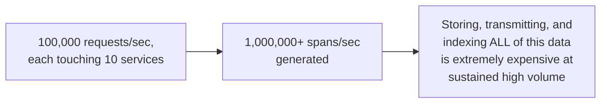
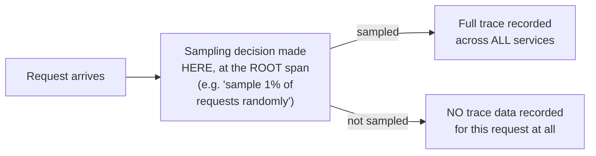
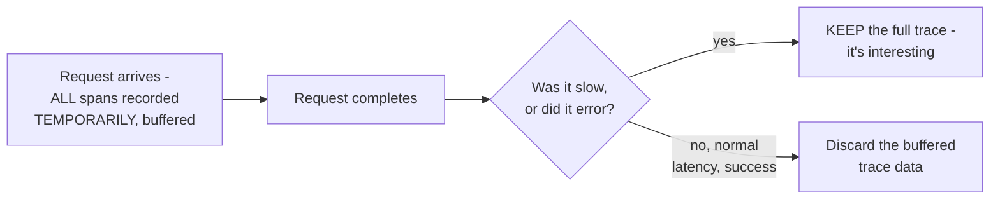

# Distributed Tracing — Senior

<!-- level-focus -->
At senior level, focus on this question:

> Why can't you record a full trace for every single request at scale, and
> how are sampling decisions actually made?

Prerequisite: [`middle.md`](middle.md).

---

## The volume problem

At meaningful production scale, recording and storing a complete trace for
**every single request** generates an enormous volume of tracing data —
the storage, network, and processing cost of capturing 100% of traces
becomes a significant, and often prohibitive, expense in its own right.

## Head-based sampling: decide at the start

The simplest approach: decide **once**, at the request's entry point,
whether to trace it at all (e.g. randomly sample 1% of requests), and
propagate that decision downstream (as a flag in the trace context) so
every service either fully participates in tracing this request or does
none of the tracing work for it. Simple and cheap, but has an obvious
flaw: **you can't choose to sample based on whether the request turns out
to be interesting** (slow, or resulted in an error) — that information
isn't known yet when the sampling decision is made.

## Tail-based sampling: decide at the end, based on outcome

**Tail-based sampling** buffers spans temporarily (in a collector — see
`professional.md`) and makes the sampling decision **after** the whole
request completes, specifically favoring keeping traces for **slow or
failed** requests — exactly the requests you most want tracing data for
when debugging — at the cost of requiring more buffering
infrastructure (spans must be held until the full trace completes, which
could be seconds for a slow request) than head-based sampling's
immediate, per-request decision.

> 🎯 **Senior takeaway:** sampling is a mandatory cost-control mechanism
> at scale, not an optional nice-to-have — the real design decision is
> head-based (simple, cheap, but samples uniformly regardless of interest)
> vs. tail-based (more infrastructure, but specifically preserves the
> traces most valuable for debugging: slow and failed requests).

## Test yourself

1. Why does head-based sampling's "decide at the start" approach mean you
   can't specifically prioritize keeping traces for slow or failed
   requests?
2. Why does tail-based sampling require more buffering infrastructure than
   head-based sampling?
3. Design a hybrid sampling policy: what would you do differently for a
   request that's part of a known-critical business flow (e.g. checkout)
   versus a routine health-check endpoint?

Continue to [`professional.md`](professional.md) to see OpenTelemetry's
collector pipeline architecture that implements this at scale.
