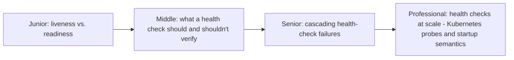
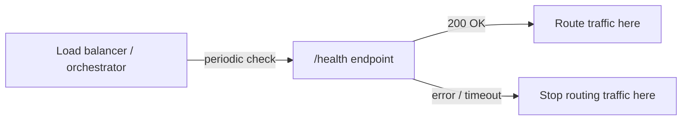

# Health Endpoint Monitoring

> A `/health` endpoint sounds trivial — return 200 if you're up. Getting it
> right (liveness vs. readiness, avoiding false positives, not lying about
> downstream health) is what actually determines whether your
> orchestrator/load balancer makes correct decisions during an incident.

## Choose a level

| Level | Guide | You are done when |
|---|---|---|
| Junior | [Liveness vs. readiness](junior.md) | You can explain the difference and why conflating them causes real incidents. |
| Middle | [What to check, and what not to](middle.md) | You can design a health check that's neither too shallow nor too deep. |
| Senior | [Cascading health-check failures](senior.md) | You can explain how a health check that's too deep can cause a healthy fleet to appear down all at once. |
| Professional | [Kubernetes probes at scale](professional.md) | You can configure liveness/readiness/startup probes correctly for a real production deployment. |

## Practice rule

For your service's health check, ask: "if a downstream dependency I don't
own goes down, should MY instance be marked unhealthy and pulled from
rotation, or should I still serve the requests I can handle without that
dependency?" The answer determines whether your health check is checking
the right thing.

## Related

- [Circuit Breaker](../circuit-breaker/README.md)
- [Redundancy & Failure Domains](../redundancy-and-failure-domains/README.md)
