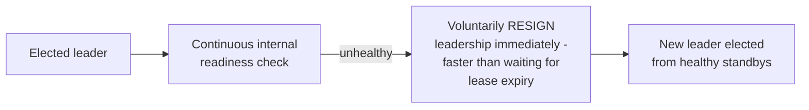
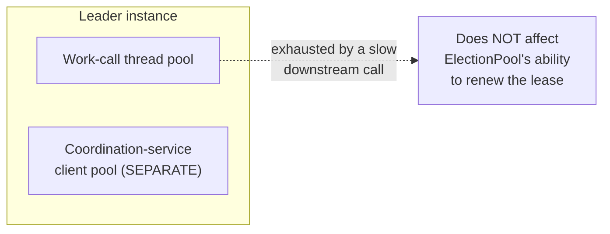

# Leader Election (Reliability Pattern) — Professional

<!-- level-focus -->
At professional level, focus on this question:

> How does leader election compose with health checks, circuit breakers,
> and bulkheads in a coherent, production-grade reliability architecture?

Prerequisite: [`senior.md`](senior.md).

---

## Leader election needs its own health signal, distinct from the job's health

A leader instance that's elected but subsequently becomes unhealthy (its
own internal state is broken, though it still holds the lease) is a
dangerous combination — it's still "the leader" from the coordination
service's point of view, but it can't actually do the work correctly. The
professional-level composition: the leader instance should run its own
[readiness check](../health-endpoint-monitoring/README.md) on the
**work itself**, and voluntarily **resign** leadership (an explicit
`Resign()`/step-down call, per the consensus topic's professional page)
the moment it detects it can't reliably continue — rather than waiting
passively for its lease to expire, which is slower and leaves a longer
window where the "leader" is claimed but non-functional.



## Circuit breakers protect the leader's own downstream calls

The elected leader, while doing its singleton work, still calls its own
downstream dependencies — and those calls need the same
[Circuit Breaker](../circuit-breaker/README.md) protection as any other
service code. A subtlety worth calling out: if the leader's downstream
dependency circuit breaker trips, that's a signal the leader might not be
able to complete its work reliably right now — which should feed into the
"should I resign" decision above, not be treated as an unrelated concern.

## Bulkheading the coordination-service client itself

Per [Bulkhead](../bulkhead/README.md), the connection/thread pool used
to talk to the coordination service (etcd/ZooKeeper) for election and
leasing should be **isolated** from the pool used for the leader's actual
work calls — if the work calls exhaust a shared pool, the instance might
fail to renew its own lease in time purely due to resource starvation
unrelated to any genuine problem with its leadership, causing an
unnecessary, avoidable failover.



## Production checklist (staff-level)

1. **Implement voluntary resignation triggered by the leader's own
   readiness check**, not just passive lease-expiry-based failover — this
   materially reduces the window where a claimed-but-non-functional leader
   blocks progress.
2. **Wrap the leader's downstream calls in circuit breakers**, and feed
   circuit state into the resignation decision — a leader whose critical
   dependency circuit is open is a leader that likely can't do its job.
3. **Bulkhead the coordination-service client's connection/thread pool
   separately from the leader's work-call pool** — prevent unrelated
   downstream resource exhaustion from causing an avoidable lease-renewal
   failure and unnecessary failover.
4. **Health-check the leadership status itself** as part of your
   monitoring (is there currently exactly one leader, per the
   `leaders_acting` gauge pattern from the consensus topic's project
   brief) — treat "zero leaders" or "more than one leader" as a
   first-class alerting condition, not just an implementation detail.
5. **In an architecture review for any leader-elected singleton system,
   require an explicit answer for how it composes with health checks,
   circuit breakers, and bulkheads** — these patterns are not independent
   checkboxes; a gap in how they interact (as this page illustrates) is a
   common source of avoidable failovers and extended incident windows.

## Cheat Sheet

```text
+------------------------------------------------------------------+
|      LEADER ELECTION (RELIABILITY PATTERN) — COMPOSITION              |
+------------------------------------------------------------------+
| Leader's own health check -> should trigger VOLUNTARY RESIGNATION,    |
| not just wait for passive lease expiry - faster failover for a         |
| self-detected problem                                                 |
+------------------------------------------------------------------+
| Leader's downstream circuit breaker state should FEED INTO the         |
| resignation decision - an open circuit on a critical dependency        |
| means the leader likely can't do its job right now                    |
+------------------------------------------------------------------+
| BULKHEAD the coordination-service client pool SEPARATELY from the      |
| leader's work-call pool - prevents unrelated resource exhaustion       |
| from causing a lease-renewal failure and unnecessary failover          |
+------------------------------------------------------------------+
| Monitor leadership status itself (leaders_acting gauge) as a           |
| first-class alert, not just an implementation detail                   |
+------------------------------------------------------------------+
```

## Test yourself

1. Why is voluntary resignation, triggered by the leader's own health
   check, faster and safer than waiting for lease expiry after the leader
   becomes non-functional?
2. Why should the leader's downstream circuit breaker state influence its
   resignation decision, rather than being treated as an unrelated
   concern?
3. Design the pool isolation strategy for a leader-elected service that
   both talks to etcd for election and makes calls to three downstream
   dependencies for its actual work.

## Further Reading

- See [Consensus: Leader Election — professional](../../consensus/leader-election/professional.md)
  for the underlying election mechanics this page composes with.
- See also: [Circuit Breaker — professional](../circuit-breaker/professional.md),
  [Bulkhead — professional](../bulkhead/professional.md).
