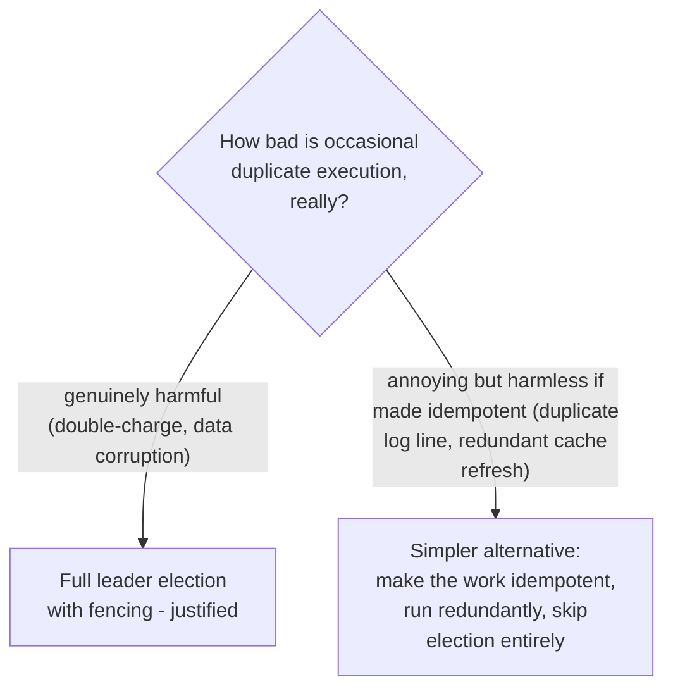

# Leader Election (Reliability Pattern) — Senior

<!-- level-focus -->
At senior level, focus on this question:

> When is full leader election overkill, and what simpler alternatives
> exist for lower-stakes singleton work?

Prerequisite: [`middle.md`](middle.md).

---

## The cost of leader election

Leader election requires a coordination service (etcd/ZooKeeper — see
[Coordination Services](../../18-concurrency-coordination/coordination-services/README.md)),
careful fencing design (see the consensus topic's `senior.md`), and ongoing
operational ownership of that coordination infrastructure. For **low-stakes**
singleton work — where occasional duplicate execution is annoying but not
actually harmful — this machinery can be genuinely unnecessary complexity.

## Simpler alternatives, when they suffice

- **Idempotent, safe-to-duplicate work**: per
  [Retries & Idempotency](../../17-background-jobs/retries-and-idempotency/README.md),
  if you can make the job's effect idempotent (e.g. an
  `INSERT ... ON CONFLICT DO NOTHING` for its output), running it
  redundantly from multiple instances is simply harmless — no election
  needed at all.
- **A simple database-backed advisory lock** (e.g. Postgres's
  `pg_try_advisory_lock`) for work that already has a database available
  and doesn't need the stronger guarantees (or added infrastructure) of a
  dedicated coordination service — a lighter-weight, if less robust,
  mutual-exclusion mechanism than full etcd/ZooKeeper-based election.
- **Scheduled-job platform built-in concurrency control**: if using
  Airflow/Kubernetes CronJob (see
  [Schedule-Driven Background Jobs](../../17-background-jobs/schedule-driven/README.md)),
  their built-in `max_active_runs`/`concurrencyPolicy` may already provide
  "don't run this twice" guarantees sufficient for many use cases, without
  needing bespoke leader election at all.

> 🎯 **Senior takeaway:** leader election is the right tool when duplicate
> execution is genuinely harmful and you need the strongest available
> guarantee. For many real "singleton" jobs, the actual requirement is
> better served by idempotency (avoiding the problem) or a lighter-weight
> lock (a smaller solution for a smaller problem) — reach for full
> consensus-based election only after confirming the simpler options
> genuinely don't fit.

## Test yourself

1. Give an example of a "singleton" job where making it idempotent would
   let you skip leader election entirely.
2. What's the trade-off of using a Postgres advisory lock instead of an
   etcd-based election for a lower-stakes locking need?
3. Why might a team default to full leader election even when a simpler
   alternative would suffice — what pressures cause this kind of
   over-engineering?

Continue to [`professional.md`](professional.md) to see leader election
composed with other reliability patterns in a real system.
