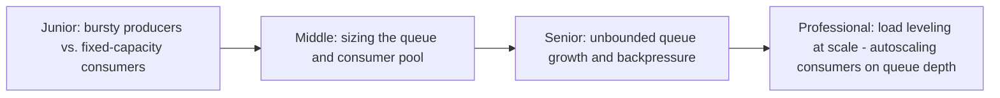
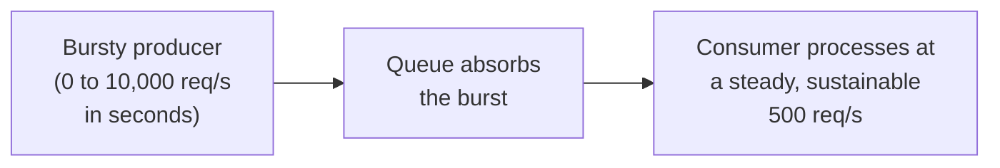

# Queue-Based Load Leveling

> Put a queue between a bursty producer and a fixed-capacity consumer, so
> the consumer processes at its own sustainable pace while the queue
> absorbs the burst — turning "handle the peak or fall over" into "handle
> the average, and let the queue smooth the rest."

## Choose a level

| Level | Guide | You are done when |
|---|---|---|
| Junior | [Bursty producers vs. fixed consumers](junior.md) | You can explain why a consumer sized for average load falls over under a burst without a queue. |
| Middle | [Sizing the queue and consumer pool](middle.md) | You can reason about queue capacity and consumer throughput together. |
| Senior | [Unbounded growth and backpressure](senior.md) | You can explain what happens if the queue itself has no size limit, and design a backpressure response. |
| Professional | [Autoscaling consumers on queue depth](professional.md) | You can design a consumer autoscaling policy driven by queue metrics. |

## Practice rule

For any queue between a producer and consumer, ask: "if the producer's
burst lasted an hour, not a minute, what happens to the queue, and does
anything eventually push back on the producer?" If the honest answer is
"the queue just keeps growing forever," you have unbounded queue risk, not
load leveling.

## Related

- [Throttling](../throttling/README.md)
- [Consumer Autoscaling on Lag](../../../event-streaming/events-driven/consumer-autoscaling-on-lag/README.md)
