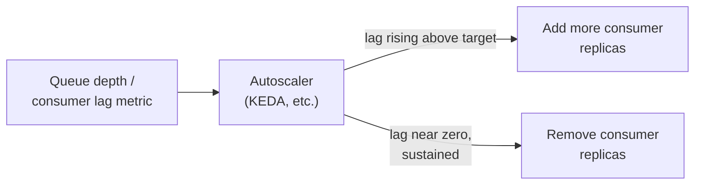
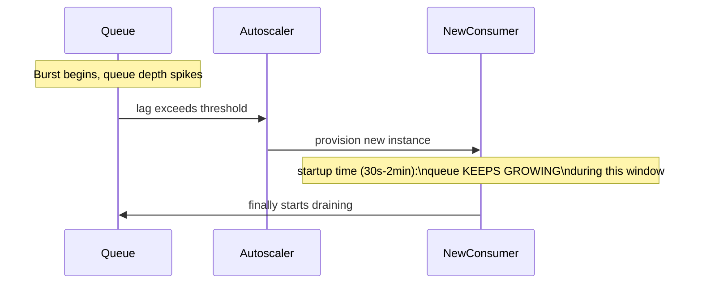

# Queue-Based Load Leveling — Professional

<!-- level-focus -->
At professional level, focus on this question:

> How do production systems autoscale the consumer pool based on queue
> depth/lag, and what are the real tuning pitfalls (scaling lag,
> thrashing) at scale?

Prerequisite: [`senior.md`](senior.md).

---

## Autoscaling consumers on queue depth: the basic mechanism

Rather than statically sizing the consumer pool (`middle.md`), production
systems dynamically scale consumer count based on real-time queue
depth/consumer lag — Kubernetes' KEDA (Kubernetes Event-Driven
Autoscaling) and cloud-native equivalents (AWS SQS-based autoscaling,
Kafka consumer group lag-based scaling) watch a metric like "messages
waiting" or "consumer lag" and add/remove consumer replicas to keep that
metric within a target range.



## The real tuning pitfall: scaling lag itself

Autoscaling isn't instantaneous — provisioning a new consumer instance
(container startup, connection warmup, per the Durable Execution
professional page's `startupProbe` discussion) takes real time, often tens
of seconds to minutes. During a **sudden** burst, the queue can grow
significantly **before** newly-scaled consumers actually come online and
start draining it — meaning the drain-time math from `middle.md` must
account for this **scaling lag** explicitly, not just steady-state
consumer throughput, or the system will still experience unacceptable
delay during the specific window between "burst starts" and "new consumers
are actually processing."



## Scaling thrashing: reacting too fast to noisy metrics

Scaling consumer count up and down rapidly in response to a naturally
noisy queue-depth signal (constant small fluctuations, not genuine
sustained trend changes) wastes resources on constant
provisioning/deprovisioning churn and can itself add latency (every scale-
down that turns out to be premature requires scaling back up again,
repeating the scaling-lag cost from above). Production autoscalers
mitigate this with **cooldown periods** (a minimum time between scaling
actions) and **stabilization windows** (requiring a metric to stay above/
below threshold for a sustained period before acting) — the same
noise-vs-signal tuning challenge as the Circuit Breaker professional
page's flapping-prevention discussion, applied to autoscaling decisions
instead of circuit state.

## Production checklist (staff-level)

1. **Account for scaling lag explicitly in your burst-handling design** —
   size a baseline "always-on" consumer capacity sufficient to absorb the
   burst during the scaling-lag window, rather than relying entirely on
   autoscaling to react instantly.
2. **Tune cooldown periods and stabilization windows against your actual
   observed queue-depth noise**, not default values — this is the same
   flapping-prevention discipline as circuit breaker threshold tuning,
   applied to a different mechanism.
3. **Monitor "time from burst start to scaled-consumer-online" as an
   explicit metric** during load testing — this scaling-lag duration is a
   direct input to whether your bounded-queue (`senior.md`) and
   backpressure design actually meets your latency SLA during real bursts.
4. **Prefer faster-starting consumer runtimes/images for latency-sensitive
   autoscaled workloads** — container/process startup time is a direct,
   controllable lever on scaling lag, and is often overlooked in favor of
   just tuning the autoscaler's own thresholds.
5. **In a capacity-planning review for a queue-based system, require load
   testing that specifically simulates a sudden, realistic burst against
   the full autoscaling pipeline** (not just steady-state throughput
   testing) — this is the only way to validate the end-to-end
   burst-to-drained latency your users will actually experience.

## Cheat Sheet

```text
+------------------------------------------------------------------+
|         QUEUE-BASED LOAD LEVELING — INTERNALS & SCALE                |
+------------------------------------------------------------------+
| Autoscaling consumers on queue depth/lag (KEDA, SQS/Kafka lag-based    |
| scaling): dynamically adds/removes consumer replicas to keep the       |
| metric within a target range, instead of static sizing                |
+------------------------------------------------------------------+
| SCALING LAG is real: provisioning a new consumer takes real time        |
| (container startup, connection warmup) - queue can grow SIGNIFICANTLY  |
| before new consumers actually start draining it. Size a baseline       |
| always-on capacity to cover this window, don't rely on instant          |
| autoscaler reaction                                                    |
+------------------------------------------------------------------+
| Scaling THRASHING: reacting to noisy queue-depth fluctuations wastes    |
| resources and adds latency from repeated scale-up/down cycles - use    |
| cooldown periods and stabilization windows, same discipline as          |
| circuit-breaker flapping prevention                                   |
+------------------------------------------------------------------+
```

## Test yourself

1. Why can a queue grow significantly even after an autoscaler correctly
   detects a burst and starts provisioning new consumers?
2. Why does scaling thrashing waste resources beyond just the direct cost
   of provisioning/deprovisioning instances?
3. Design a load test that would reveal whether your system's actual
   burst-to-drained latency meets its SLA, accounting for realistic
   scaling lag.

## Further Reading

- KEDA documentation — "Scalers" (queue-depth and consumer-lag-based
  autoscaling triggers).
- AWS documentation — "Using Amazon SQS to autoscale Amazon EC2" (a
  documented reference architecture for queue-driven autoscaling).
- See also: [Consumer Autoscaling on Lag](../../../event-streaming/events/consumer-autoscaling-on-lag/README.md),
  [Circuit Breaker — senior](../circuit-breaker/senior.md) (flapping-
  prevention, the same noise-tuning discipline).
