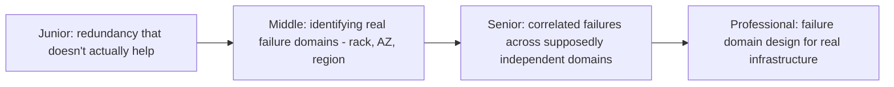
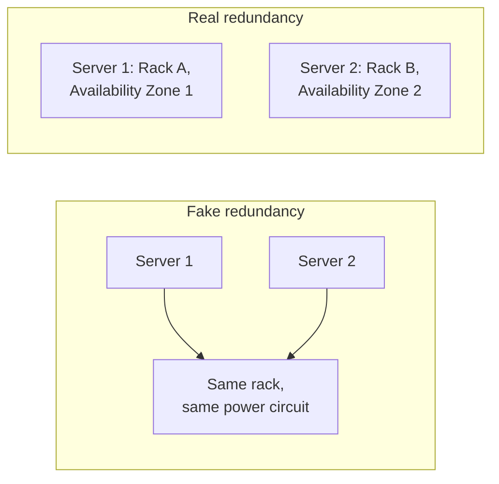

# Redundancy & Failure Domains

> Running two copies of something only helps if the thing that could take
> down the first copy can't also take down the second. A failure domain is
> the boundary of "things that could fail together" — and redundancy only
> counts if it crosses that boundary.

## Choose a level

| Level | Guide | You are done when |
|---|---|---|
| Junior | [Redundancy that doesn't actually help](junior.md) | You can identify a "redundant" setup that shares a hidden single point of failure. |
| Middle | [Rack, AZ, region](middle.md) | You can map redundancy decisions onto real cloud infrastructure failure domain boundaries. |
| Senior | [Correlated failures](senior.md) | You can explain how failures can correlate across supposedly independent domains. |
| Professional | [Failure domain design at scale](professional.md) | You can design multi-region redundancy accounting for real, documented correlated-failure incidents. |

## Practice rule

For any "redundant" pair or set of resources, ask: "what specific,
nameable thing (a power circuit, a network switch, a physical building, a
cloud provider's control plane) would have to fail to take out ALL of
these at once?" If you can't name something sufficiently independent, you
don't have real redundancy.

## Related

- [Deployment Stamps & Geodes](../deployment-stamps-and-geodes/README.md)
- [Shuffle Sharding](../shuffle-sharding/README.md)
