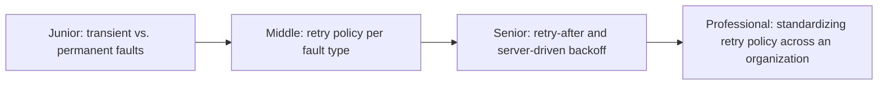
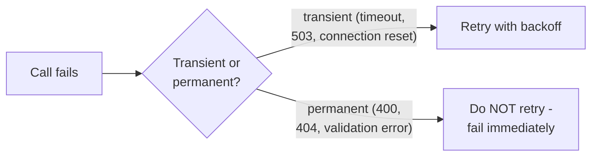

# Retry (Reliability Pattern)

> The general-purpose reliability pattern for transient faults — this page
> covers the pattern's classification and policy design; the deep mechanics
> of backoff, jitter, and retry budgets already live in
> [Retries & Idempotency](../../../schedule-jobs/retries-and-idempotency/README.md).

## Choose a level

| Level | Guide | You are done when |
|---|---|---|
| Junior | [Transient vs. permanent faults](junior.md) | You can classify a set of error types as retryable or not. |
| Middle | [Retry policy per fault type](middle.md) | You can design a policy that retries transient faults and fails fast on permanent ones. |
| Senior | [Retry-After and server-driven backoff](senior.md) | You can explain why letting the server dictate backoff timing beats client-guessed backoff. |
| Professional | [Standardizing retry policy](professional.md) | You can design an organization-wide retry policy library/standard. |

## Practice rule

Before retrying any failure, classify it first: "is this the kind of
failure that might succeed on a second attempt (a timeout, a 503), or is
it something that will fail identically every time (a 400 Bad Request, a
validation error)?" Retrying the second category wastes effort and can mask
real bugs.

## Related

- [Retries & Idempotency](../../../schedule-jobs/retries-and-idempotency/README.md)
- [Circuit Breaker](../circuit-breaker/README.md)
