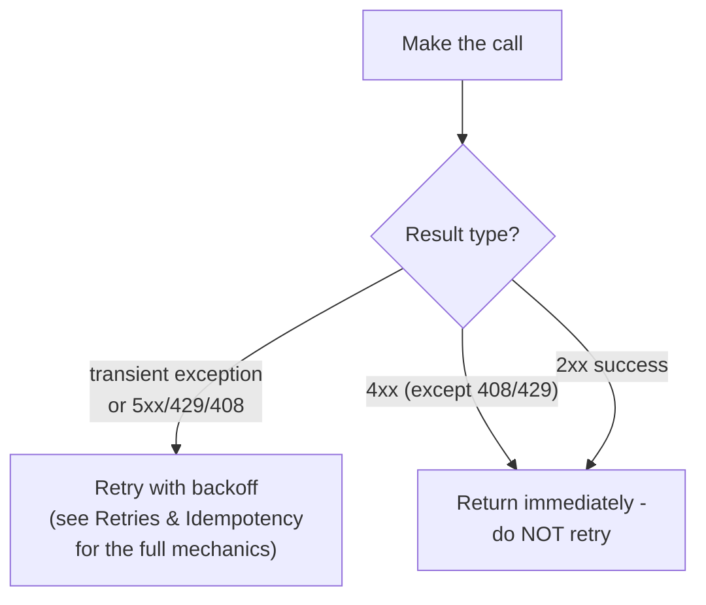

# Retry — Middle

<!-- level-focus -->
At middle level, focus on this question:

> How do you encode fault classification into an actual retry policy?

Prerequisite: [`junior.md`](junior.md).

---

## A classification-driven retry policy

```python
RETRYABLE_STATUS_CODES = {408, 429, 500, 502, 503, 504}
RETRYABLE_EXCEPTIONS = (ConnectionError, TimeoutError)

def call_with_retry(fn, max_attempts=3):
    for attempt in range(max_attempts):
        try:
            response = fn()
            if response.status_code in RETRYABLE_STATUS_CODES:
                raise TransientError(response.status_code)
            return response  # includes non-retryable 4xx - return as-is
        except RETRYABLE_EXCEPTIONS + (TransientError,) as e:
            if attempt == max_attempts - 1:
                raise
            time.sleep(backoff_with_jitter(attempt))
    raise Exception("unreachable")
```



Note `429 Too Many Requests` and `408 Request Timeout` are the notable
**4xx exceptions** that ARE worth retrying — a 429 specifically means "you
were rate-limited, try again later," which is inherently transient, unlike
most other 4xx codes that indicate a genuinely malformed or invalid
request.

> 🎓 **Takeaway:** a good retry policy is essentially a lookup table
> (status code/exception type → retry or not) applied consistently, with
> the actual backoff mechanics (exponential backoff, jitter, retry budgets)
> handled by the machinery covered in
> [Retries & Idempotency](../../17-background-jobs/retries-and-idempotency/README.md) —
> this page's job is specifically the *classification* layer sitting in
> front of that machinery.

## Test yourself

1. Why is `429 Too Many Requests` retryable despite being in the 4xx
   range, unlike most other 4xx codes?
2. Why does the example return non-retryable responses immediately rather
   than raising an exception for them?
3. Design the classification table for a gRPC-based service (gRPC status
   codes differ from HTTP) — which gRPC status codes would you mark
   retryable?

Continue to [`senior.md`](senior.md).
