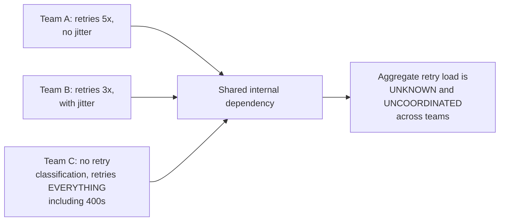
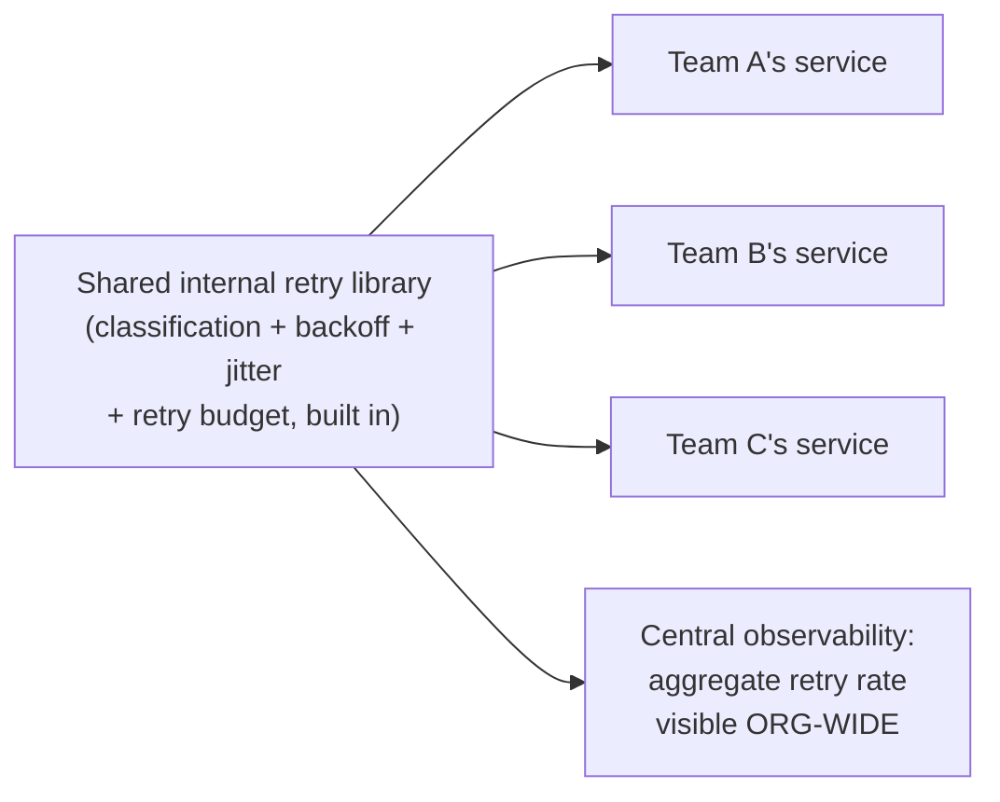

# Retry — Professional

<!-- level-focus -->
At professional level, focus on this question:

> How do you standardize retry policy across dozens of services in an
> organization, and why does inconsistent per-team retry logic itself
> become a reliability risk?

Prerequisite: [`senior.md`](senior.md).

---

## Inconsistent retry policy as an organizational risk

If every team independently implements its own retry logic (different
classification tables, different backoff parameters, no shared retry
budget awareness), the organization ends up with the exact
retry-amplification risk from the Retries & Idempotency professional
page, but **compounded by inconsistency**: one team's aggressive retry
policy on a shared internal dependency can degrade that dependency for
every other team calling it, and there's no organization-wide visibility
into total retry load across all these independently-implemented policies.



## The fix: a shared retry library, enforced by policy

Production organizations at scale (documented in engineering blogs from
companies running large microservice fleets) standardize this via a
**shared internal library** (an internal wrapper around resilience4j,
Polly, or a custom equivalent) that every service is required to use for
outbound calls — encoding the classification table (`middle.md`),
backoff/jitter (Retries & Idempotency), `Retry-After` handling
(`senior.md`), and retry budget enforcement (Retries & Idempotency
professional page) as **defaults that require explicit override to
bypass**, rather than leaving every team to reimplement (and likely
under-implement) this logic independently.



## Centralized retry observability

A shared library also enables **organization-wide visibility** into
aggregate retry rates against any given dependency — critical for
detecting the retry-amplification risk across teams (Retries & Idempotency
professional page's multi-hop amplification, but now visible as a
cross-team, cross-service phenomenon) that no single team's own metrics
would reveal in isolation.

## Production checklist (staff-level)

1. **Build or adopt a shared, mandatory retry library** encoding
   classification, backoff/jitter, `Retry-After` handling, and retry
   budgets as defaults — don't leave retry policy design to be
   independently reinvented (and inconsistently implemented) per team.
2. **Instrument aggregate retry rate per dependency, organization-wide**,
   not just per-service — this is the only way to detect cross-team retry
   amplification against a shared internal dependency.
3. **Require explicit justification and review for any service opting out
   of the standard retry library's defaults** — inconsistency is the root
   risk this whole page addresses.
4. **Periodically audit actual retry behavior against the documented
   policy** — a shared library's existence doesn't guarantee every team
   configured it correctly; verify via the centralized observability from
   above.
5. **In a platform/infrastructure review, treat retry policy standardization
   as core reliability infrastructure**, with the same investment priority
   as your circuit breaker and bulkhead standards — these three patterns
   compose and should be designed together, not independently per team.

## Cheat Sheet

```text
+------------------------------------------------------------------+
|                    RETRY — INTERNALS & SCALE                        |
+------------------------------------------------------------------+
| Inconsistent, per-team retry logic across an organization creates      |
| UNCOORDINATED aggregate retry load against shared dependencies -       |
| a compounded version of the multi-hop retry amplification risk         |
+------------------------------------------------------------------+
| Fix: a SHARED, MANDATORY retry library encoding classification,        |
| backoff+jitter, Retry-After handling, and retry budgets as defaults -  |
| explicit override required to bypass, not independent reimplementation|
+------------------------------------------------------------------+
| Centralized, org-wide retry-rate observability is what makes           |
| cross-team amplification visible - no single team's metrics reveal it |
+------------------------------------------------------------------+
```

## Test yourself

1. Why can inconsistent per-team retry policies create a risk that no
   single team's own monitoring would ever reveal?
2. Design the minimum feature set a shared internal retry library should
   provide as non-optional defaults.
3. In a platform review, how would you detect whether teams are actually
   using the shared retry library correctly, versus just having it
   available?

## Further Reading

- RFC 9110 §10.2.3 — "Retry-After" (the HTTP standard header).
- Google SRE Workbook — Chapter 5, "Alerting on SLOs" (adjacent
  organization-wide reliability standardization practices).
- See also: [Retries & Idempotency — professional](../../17-background-jobs/retries-and-idempotency/professional.md),
  [Circuit Breaker — professional](../circuit-breaker/professional.md).
