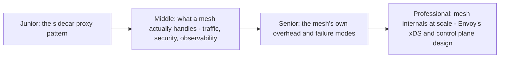
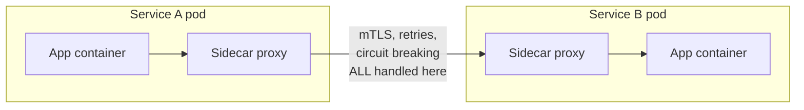

# Service Mesh

> Move cross-cutting network concerns — retries, circuit breaking, mTLS,
> observability — out of application code and into a dedicated
> infrastructure layer (a proxy sidecar per service) that every service
> gets for free, consistently, without each team reimplementing it.

## Choose a level

| Level | Guide | You are done when |
|---|---|---|
| Junior | [The sidecar proxy pattern](junior.md) | You can explain why intercepting traffic via a sidecar avoids per-service reimplementation. |
| Middle | [What a mesh actually handles](middle.md) | You can list the concerns a mesh moves out of application code. |
| Senior | [The mesh's own overhead](senior.md) | You can explain the latency/complexity cost every request now pays, and when that's not worth it. |
| Professional | [Envoy's xDS and control plane](professional.md) | You can explain how a mesh's control plane pushes configuration to thousands of proxies consistently. |

## Practice rule

Before adopting a service mesh, ask: "which specific cross-cutting
concerns (retries, mTLS, circuit breaking, tracing) are currently
duplicated, inconsistently implemented, or missing across our services?"
If the honest answer is "not many, and our few services already share a
common library," the mesh's operational complexity may not be worth it yet.

## Related

- [Circuit Breaker](../circuit-breaker/README.md)
- [Coordination Services](../../coordination/coordination-services/README.md)
