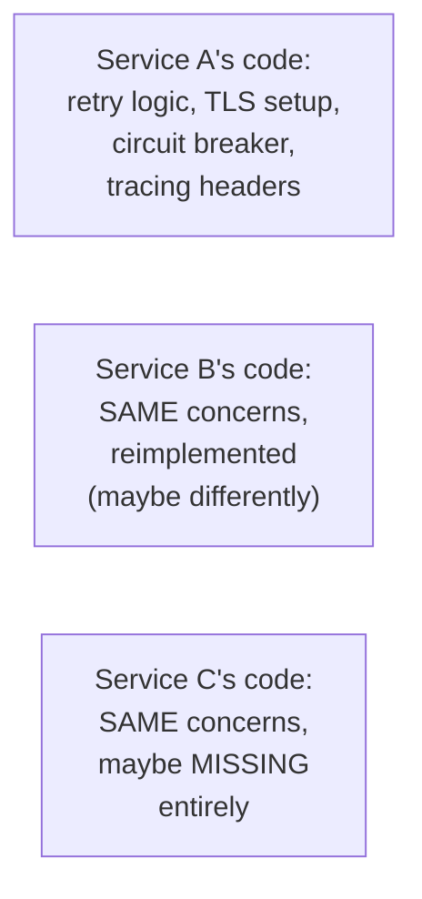
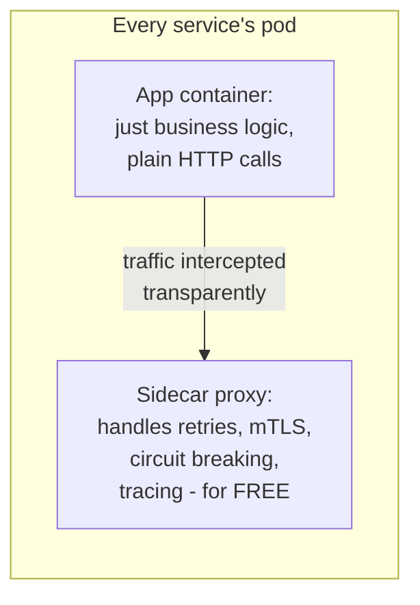

# Service Mesh — Junior

<!-- level-focus -->
At junior level, focus on this question:

> Why does putting a proxy alongside every service instance avoid every
> team having to reimplement the same networking logic?

---

## Without a mesh: every service reimplements networking concerns

If every team's service must independently implement retries, mutual TLS,
circuit breaking, and distributed tracing headers, you get inconsistent
(or missing) implementations across the organization — exactly the
retry-policy-inconsistency risk covered in the Retry professional page,
but generalized to every cross-cutting networking concern.

## With a mesh: a sidecar proxy handles it, transparently

A **service mesh** deploys a small proxy (Envoy, most commonly) as a
**sidecar** container alongside every application instance. All network
traffic in and out of the application is transparently routed through
this proxy — the application code makes a plain, simple HTTP/gRPC call as
if there were no mesh at all, and the sidecar handles retries, TLS,
circuit breaking, and observability **without the application code needing
to know or do anything special**.

> 🎓 **Takeaway:** a service mesh's core idea is moving cross-cutting
> networking concerns out of every application's code and into a shared,
> consistently-configured infrastructure layer — the same "don't
> reimplement this per-team" principle as the shared retry library from
> the Retry professional page, but implemented as network infrastructure
> instead of an application library.

## Test yourself

1. Why does a sidecar proxy avoid the same inconsistent-implementation
   risk that plagued per-team retry logic (from the Retry professional
   page)?
2. What does the application code actually have to change to benefit from
   a service mesh's retry/circuit-breaking behavior?
3. Why is "sidecar" (a container alongside the app, in the same pod) a
   good name for this pattern?

Continue to [`middle.md`](middle.md).
